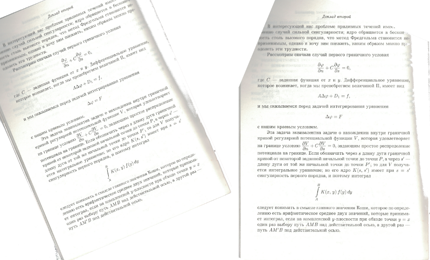
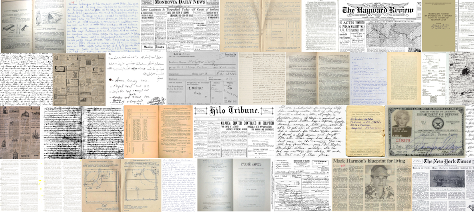

При оптическом распознавании текста на сканированных документах качество распознавания зависит от того, наклонён ли текст в документе. У выровненных документов качество распознавания заметно лучше. Соответственно, возникает практическая необходимость в средствах автоматического выравнивания угла наклона текста.

В статье предлагается простой, универсальный и достаточно эффективный алгоритм выравнивания наклона текста, основанный на идее минимизации средней энтропии строк и столбцов растрового изображения.

---



---

## Идея

Базовая идея алгоритма состоит в том, что при повороте текста на сканированном изображении средняя, по строкам и столбцам, энтропия распределения пикселей должна возрасти.

Предположим, нам дан чёрно-белый скан изображения. То есть, каждый пиксель может принимать только два значения: 0 или 1. Как известно, энтропия равномерного распределения максимальна. Если изображение повёрнуто, то в среднем, распределение чёрных и белых пикселей по строкам (и столбцам) будет ближе к равномерному, чем у неповёрнутого изображения. У выровненного изображения распределение пикселей в среднем должно быть менее равномерным.



Гипотеза состоит в том, чтобы вычислить среднюю по строкам и столбцам энтропию распределения пикселей для разных углов поворота и найти такой угол, при котором эта усреднённая энтропия примет минимальное значение.

Для проверки этой гипотезы в интернете был собран набор данных различных видов сканированных изображений, после чего предположения были проверены экспериментально.

Предложенный подход работает и позволяет абсолютно точно определить угол поворота в 83% случаев и с точностью до 1° — в 98% случаев.

Хотя, на первый взгляд, энтропия Шеннона хорошо подходит для этой задачи, было бы разумно не ограничиваться только ей, а рассмотреть весь спектр энтропий Реньи. И с учётом полученных результатов, а также вычислительной сложности, выбрать оптимальное значение параметра энтропии Реньи.

Энтропия Реньи вычисляется по формуле:

$$
R_{\alpha} = \frac{1}{1-\alpha} \log\left( \sum_{i=1}^{n}p_i^{\alpha} \right),
$$

где $p_i$ — вероятности, соответствующие распределению (в нашем случае — частоты чёрных и белых пикселей).

В случае $\alpha = 1$ это превращается в энтропию Шеннона:

$$
R_{1} = H = - \sum_{i=1}^{n} p_i \log(p_i)
$$

---

## Эксперимент

Для проведения эксперимента был собран набор различных документов в сети Интернет. Каждое изображение из набора было повёрнуто на случайный угол в интервале от -45° до 45°, после чего был вычислен угол поворота с помощью предложенного алгоритма.



В таблице ниже представлены результаты для различных значений параметра энтропии Реньи $\alpha$:

| Параметр энтропии Реньи $\alpha$ | 1/8   | 1/4   | 1/2   | 3/4   | 1     | 2     | 5     |
|-----------------------------------|-------|-------|-------|-------|-------|-------|-------|
| Среднее абсолютное отклонение     | 0.498 | 0.299 | **0.211** | 0.283 | 0.240 | 5.827 | 41.099 |
| Доля полных совпадений (точность) | 0.822 | **0.834** | 0.828 | 0.815 | 0.805 | 0.641 | 0.009  |
| Доля совпадений с точностью до 1° | 0.942 | 0.969 | **0.980** | **0.982** | **0.983** | 0.822 | 0.015  |
| Доля совпадений с точностью до 2° | 0.967 | 0.983 | **0.991** | **0.993** | **0.994** | 0.841 | 0.015  |

Всего было обработано 1665 документов.

**Выводы из таблицы:**

- Наименьшее среднее абсолютное отклонение достигается при $\alpha = \frac{1}{2}$.
- Наилучшая точность (доля полных совпадений) — при $\alpha = \frac{1}{4}$.
- Наилучшая приемлемая точность (доля совпадений с точностью до 1° и до 2°) — при $\alpha \in \{1, \frac{3}{4}, \frac{1}{2}\}$.

Если рассматривать методику как часть комплекса оптического распознавания документов, то наилучшим значением оказывается $\alpha = \frac{1}{2}$.

При $\alpha = \frac{1}{2}$ среднее абсолютное отклонение составит всего $0.211^\circ$. При этом достигается оптимальная доля совпадений с точностью до 1°.

Есть ещё одна причина выбрать $\alpha = \frac{1}{2}$: при этом значении достигается оптимальная вычислительная сложность.

Ниже представлены результаты бенчмарка многократного вычисления энтропий для различных значений параметра $\alpha$:

| $\alpha$ | nanoseconds | miliseconds | % of Shannon |
|----------|-------------|-------------|--------------|
| 1        | 10249895206 | 10249       | 100          |
| 1/2      | 8677368472  | 8677        | 84.66        |
| 1/4      | 10421639934 | 10421       | 120.1        |
| 1/8      | 13235709810 | 13235       | 127          |
| 3/4      | 11403406522 | 11403       | 86.16        |
| 2        | 7245386547  | 7245        | 63.54        |
| 5        | 7771674801  | 7771        | 107.26       |
| 10       | 10809162384 | 10809       | 139.08       |

Из таблицы видно, что среди подходящих значений $\alpha$ наилучшая производительность достигается при $\alpha = 1/2$.

---

## Алгоритм

> **Замечание:**  
> Предлагаемый ниже алгоритм ([исходный код на GitHub](https://github.com/valmat/rotate_detection)) предполагает, что для определения угла поворота мы используем бинарное чёрно-белое растровое изображение, в котором каждый пиксель может принимать два значения: 0 или 1.
>
> Для применения алгоритма необходимо получить бинаризованную копию изображения.
>
> Я реализовал алгоритм с применением библиотеки *libleptonica* (используется в TesseractOCR). Для этого использовал последовательное преобразование `pixContrastTRC` с `contrast_factor = 1.0` и затем `pixConvertTo1` с `threshold = 170`.

Пусть $h$ — высота, $w$ — ширина исходного изображения. Пусть $d = \sqrt{w^2 + h^2}$ — длина диагонали.

Будем поворачивать изображение на угол $\phi$ относительно центра изображения и считать среднюю энтропию по строкам и столбцам. Чтобы не выйти за границы, мысленно расширим полотно до размеров $d \times d$.

Определим:

- $x_{from} = \frac{d}{2} - \frac{h |\sin(\phi)| + w |\cos(\phi)|}{2}$,
- $x_{to}   = d - x_{from}$,
- $y_{from} = \frac{d}{2} - \frac{h |\cos(\phi)| + w |\sin(\phi)|}{2}$,
- $y_{to}   = d - y_{from}$

где $x_{from}$ и $x_{to}$ — границы по ширине, $y_{from}$ и $y_{to}$ — по высоте.

Нужно посчитать среднюю энтропию по строкам (и аналогично по столбцам).

Пусть $V(x, y)$ — цвет пикселя $(x, y)$ (0 или 1), $R(\{p, q\})$ — энтропия распределения $\{p, q\}$.

Алгоритм расчёта средней энтропии $S_{\phi}$ для угла $\phi$ (по строкам):

```pseudo
S_phi = 0
for y in y_from .. y_to:
    b = 0  // количество чёрных пикселей в строке
    for x in x_from .. x_to:
        x_tilde = x - d/2
        y_tilde = y - d/2
        x' = x_tilde * cos(phi) - y_tilde * sin(phi) + w/2
        y' = x_tilde * sin(phi) + y_tilde * cos(phi) + h/2
        if x' >= 0 and x' < w and y' >= 0 and y' < h:
            b = b + V(x', y')
    p = b / d
    q = 1 - p
    S_phi = S_phi + R({p, q}) / d
```

Полученное значение $S_\phi$ — средняя энтропия для угла поворота $\phi$.

Для нахождения искомого угла поворота $\phi_0$ нужно найти минимум $S_\phi$:

$$
\phi_0 = -\arg\min_\phi S_\phi
$$

Знак минус берётся потому, что для выравнивания изображения нужно повернуть его в обратную сторону.

---

## Ссылки

- [WikiPedia: Энтропия Реньи (ru)](https://ru.wikipedia.org/wiki/Энтропия_Реньи)
- [Исходный код алгоритма на GitHub (C++)](https://github.com/valmat/rotate_detection)
- [Исходный код бенчмарка производительности энтропий на C++](https://gist.github.com/valmat/6a737cc3783449c4f7a829e77c77393e)
- [Бенчмарк производительности энтропий](/posts/2022/02/entropy-benchmark/)
