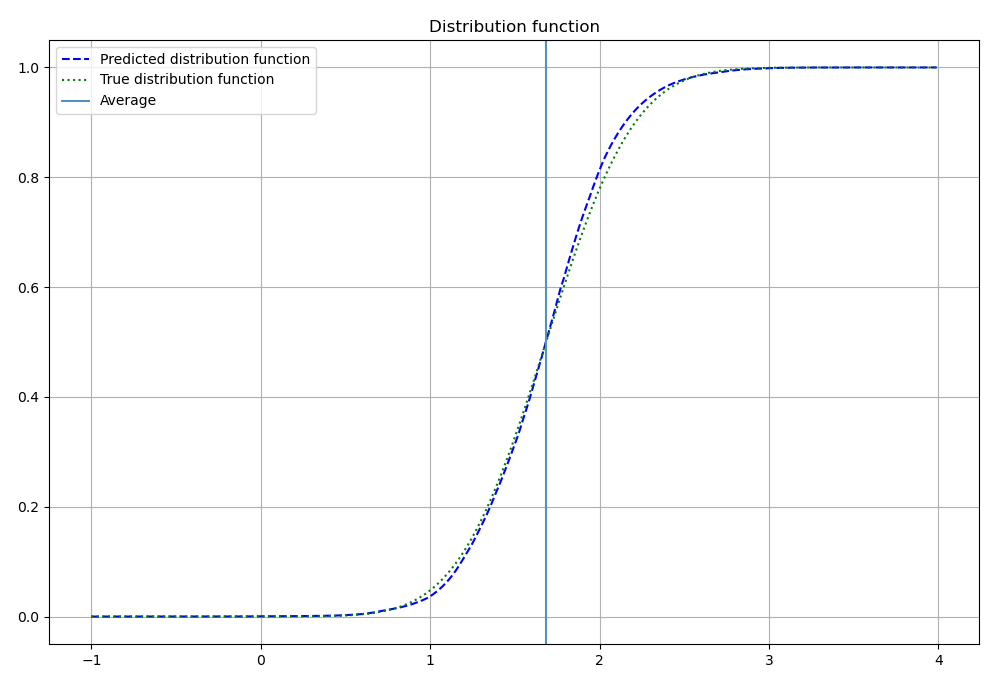

Приводится алгоритм нахождения функций распределения в качестве решения задачи регрессии.

В общем виде задачу регрессии можно сформулировать как восстановление зависимости  
$\phi: X \to L_1(\Omega)$,  
сопоставляющей элементам некоторого фазового пространства $X$ случайную величину $\xi \in L_1(\Omega)$.

Классический подход к решению задачи регрессии состоит в нахождении среднего значения $E[\phi(x)]$ для каждого $x \in X$.

В статье предлагается простой алгоритм оценки распределений случайных величин $\phi(x) \in L_1(\Omega)$.

[GitHub](https://github.com/valmat)

---


---

## Мотивация

В анализе данных значительное место занимают два класса задач — задачи классификации и регрессии.

Так сложилось, что, хотя эти задачи очень похожи, подход к их решению отличается.

Большинство алгоритмов решения задач **классификации** позволяют не просто оценить среднее значение $E[\phi(x)]$ для каждого элемента фазового пространства $X$, но и найти плотность распределения.

Для задач **регрессии** обычно находят лишь некоторую числовую оценку $\widehat{\phi(x)}$, которая, чаще всего, является средним значением, но не находят плотность распределения.

Знание плотности распределения даёт гораздо больше возможностей для принятия решений, чем просто оценка среднего.

Например, для заданной точки $x \in X$ мы можем:

- Оценить уверенность прогноза в каждой конкретной точке.
- Найти не среднее, а наиболее вероятное значение случайной величины. Это особенно актуально, если распределение $\phi(x)$ является мультимодальным.
- Определить доверительный интервал возможных значений оценки $\widehat{\phi(x)}$.
- Вычислить любые характеристики распределения, определяемые конкретной задачей и позволяющие более взвешенно и точно принимать решения на основе прогноза модели.

---

## Описание подхода

### Постановка задачи

Для простоты опишу подход для одномерной задачи регрессии. В многомерном случае подход аналогичен.

Имеем некоторое фазовое пространство $X$ и закономерность

$$
\phi: X \to L_1(\Omega, \R)
$$

$\phi$ сопоставляет случайные величины из $L_1(\Omega)$ точкам фазового пространства $X$.

Таким образом, мы имеем семейство вероятностных мер $\{P_x\}_{x \in X}$, порождаемых закономерностью $\phi$.

Нам нужно построить модель, порождающую параметрическое семейство вероятностных мер 

$$
\{Q_{x\, \theta}\}_{x \in X, \theta \in \Theta}
$$

и найти оптимальное значение параметра $\theta_0 \in \Theta$, дающее наилучшее, в некотором смысле, приближение реальных распределений $\{P_x\}_{x \in X}$:

$$
Q_{x\, \theta_0} \sim P_x
$$

При этом мы располагаем выборкой точек $\{(x_i, y_i)\}_{i=1}^N$, порожденной $N$ независимыми испытаниями: $x_i \in X$, $y_i = \phi(x_i)$.

$y_i \in L_1(\Omega)$ — являются независимыми случайными величинами. $x_i \in X$, в общем случае, случайными величинами могут и не быть.

Чтобы понять как строить модель, решающую поставленную задачу, посмотрим как она решается в случае задач классификации.

В приведенной выше постановке задачи единственным отличием задачи классификации от задачи регрессии является то, что для задач классификации вероятностное пространство $L_1(\Omega)$ является дискретным.

Когда задача моделирования распределения решается для дискретного $L_1(\Omega)$, т.е. для классификации, реальную плотность распределения приближают функциями вида

$$
\sum_{k=1}^K  \mathbf{1}_{A_k}
$$

где $A_k \subseteq \Omega$, $\mathbf{1}_{A}$ — характеристическая функция множества $A$.

Именно так мы и поступим.

Только для решения задачи регрессии моделировать лучше не плотность, а функцию распределения. На это есть ряд причин.

Во-первых, использование функции распределения является более робастным, чем использование плотности.

Во-вторых, плотность распределения должна удовлетворять свойству $\int_{\R} p(t) dt = 1$. Это свойство может быть сложнее удовлетворить при построении модели, чем соответствующее ограничение на функцию распределения:

$$
\lim\limits_{t \to -\infty}F(t) = 0, \\
\lim\limits_{t \to +\infty}F(t) = 1.
$$

---

### Построение модели

Вместо привычной для регрессии модели

$$
M_{\theta}: X \to \R
$$

и последующего нахождения $\theta$ путём оптимизации, будем строить модель, сразу приближающую функции распределения:

$$
M_{\theta}: X \to (\R \to [0, 1])
$$

или, что то же самое:

$$
M_{\theta}: X \times \R \to [0, 1]
$$

То есть каждой паре $(x, t)$, $x \in X, t \in \R$, наша модель будет сопоставлять число в интервале $[0, 1]$.

Например, для нейронных сетей этого легко добиться, поместив сигмоиду последним слоем сети.

Информация о реальном семействе распределений $\{P_x\}_{x \in X}$ , которой мы располагаем, отражена в имеющейся у нас обучающей выборке $\{(x_i, y_i)\}_{i=1}^N$.

Эта обучающая выборка порождает набор тривиальных функций распределения $\{F_i\}_{i=1}^N$:

$$
F_i(t) = 
\begin{cases}
1, & t \geqslant y_i \\
0, & t < y_i \\
\end{cases}
$$

Чтобы уйти от задачи построения модели, аппроксимирующей выборку функций, к хорошо изученной задаче построения модели, аппроксимирующей выборку точек, перейдем от выборки $\{(x_i, y_i)\}_{i=1}^N$ к выборке

$$
\bigcup\limits_{i=1}^N \{(x_i, t_j, F_i(t_j))\}_{j \in J_i}
$$

Для этого для каждого $i = 1...N$ случайным образом подберём числа $t_j$ для $j \in J_i$ из некоторого диапазона допустимых значений $y$.

Таким образом, мы снова приходим к классической задаче регрессии, но фазовым пространством для нее будет не исходное пространство $X$, а пространство $X \times Y$, где $Y \subseteq \R$ — множество допустимых значений $y$.

То есть мы получили обычную задачу регрессии для выборки $\{(z_k, u_k)\}_{k=1}^M$, где  
$z_k = (x_l, t_s)$, а $u_k = F_l(t_s) \in [0, 1]$, для некоторых $l$ и $s$.

Для решения этой задачи можно применить любой алгоритм обучения с учителем из арсенала методов решения задач регрессии.

---

### Ограничения

Поскольку описанный выше способ моделирует построение функций распределения, наша модель должна удовлетворять некоторым дополнительным ограничениям.

Пусть

$$
M_{\theta}: X \times Y \to [0, 1], \theta \in \Theta
$$

— параметрическое семейство моделей, и $\theta_0$ — оптимальная оценка параметра, дающая приближение реального семейства распределений $\{P_x\}_{x \in X}$, и

$$
M = \lim\limits_{\theta \to \theta_0, \theta \in \Theta} M_{\theta}
$$

— итоговая модель.

Тогда должны быть выполнены требования:

- Для каждого $x \in X$ $M(x, \cdot): t \to [0, 1] $ — является функцией некоторого распределения.

То есть должны быть удовлетворены следующие условия:

1. $\lim\limits_{t \to -\infty} M(x ,t) = 0$,  
   $\lim\limits_{t \to +\infty} M(x ,t) = 1$
2. $t_1 \leqslant t_2 \Rightarrow M(x, t_1) \leqslant M(x, t_2)$ 
3. $M(x, t) \in [0, 1],\, \forall t \in \R$

Все эти условия, в общем случае, не обязаны выполняться по построению моделей $M_{\theta}$ способом, описанным выше.

Условие (3) может быть удовлетворено путём наложения ограничений на саму модель. Например, для нейронных сетей можно последним слоем разместить сигмоиду.

Практика показала, что для правильно построенной модели при достаточном объеме обучающей выборки условия (1) и (2) будут выполнены автоматически. Но эти условия должны быть вынесены на этап валидации в качестве дополнительного обязательного критерия правильности построения модели.

---

## Итоговый алгоритм

Кратко опишем алгоритм.

Дана обучающая выборка $\{(x_i, y_i)\}_{i=1}^N$.

1. **Находим диапазон допустимых значений $Y$.**  
   Например,
   $$
   Y = [\min\limits_{i} y_i - a, \max\limits_{i} y_i + a],
   $$
   где $a$ — некоторое число, подбираемое исследователем.

2. **Для каждой пары $(x_i, y_i)$ случайно генерируем набор точек $\{t_j\}_{j \in J_i} \subseteq Y$.**  
   $\{t_j\}$ нужно генерировать так, чтобы было достаточно точек, лежащих левее $y_i$ и достаточно точек, лежащих правее $y_i$.  
   Можно задать разбиение $\{t_j\}_{j \in J} \subseteq Y$ одинаковое для всех $i$, но тогда мы теряем разнообразие обучающей выборки в тех случаях, когда $(x_i, y_i)$ и $(x_k, y_k)$ — близкие, но не совпадающие точки.

3. **После того, как точки $\{t_j\}_{j \in J_i}$ сгенерированы, генерируем новую обучающую выборку, как объединение выборок:**
   
   $$
   \bigcup\limits_{i=1}^N \{(x_i, t_j, u_{i j})\}_{j \in J_i}
   $$
   
   где
   
   $$
   u_{i j} = 
   \begin{cases}
   1, & t_j \geqslant y_i \\
   0, & t_j < y_i \\
   \end{cases}
   $$
   
   Для удобства обозначим $z_{i j} = (x_i, t_j)$.  
   $z_{i j}$ будут лежать в области определения нашей модели, т.е. будут являться признаками, а $u_{i j}$ в области значений, т.е. будут являться таргетами.

4. **Новую полученную выборку лучше случайно перемешать, перед тем как приступать к обучению модели.**

5. **Строим модель обучения с учителем на обучающей выборке $\{(z_{i j}, u_{i j})\}$ как для обычной задачи регрессии.**

6. **Проводим валидацию модели.**  
   В частности, на удовлетворение условия того, что $M(x, t)$ является функцией распределения по $t$ для каждого $x \in X$, т.е. проверяем (1), (2), (3).

---

## Валидация

Как и для обычных задач регрессии, невозможно дать какие-то универсальные критерии оценки качества построения модели. Но можно дать несколько рекомендаций, позволяющих оценить это качество.

В любом случае, модель $M(x, t)$ должна быть функцией распределения по $t$ для всех $x \in X$. Если ограничения (1), (2), (3) не выполнены для $M(x, \cdot)$, то такую модель следует отвергнуть как некачественную.

Сам алгоритм по построению является обычной задачей регрессии. И к его результатам применимы все метрики качества, применяемые к задачам регрессии.

Для получения этих метрик тестовую выборку $\{(x_i, y_i)\}$ нужно привести к виду $\{(z_{i j}, u_{i j})\}$ тем же способом, что и обучающую.

Кроме того, мы можем перейти на уровень исходных данных и для каждой $x_i$ из тестовой выборки посчитать среднее значение $\widehat{y_i}$ как

$$
\widehat{y_i} = \int\limits_{t \in Y} t\, dM(x_i, t)
$$

Таким образом, мы можем оценивать качество модели так, как если бы мы не строили распределения, а решали обычную задачу регрессии.

Замечу, что в некоторых случаях вместо оценки среднего $\widehat{y}$ более уместным будет оценивать наиболее вероятное значение $y$:

$$
\widehat{y_i} = 
\arg\max \limits_{t \in Y}
\frac{\partial M(x_i, t)}{\partial t}
$$

В целом, подход с моделированием распределений вместо моделирования значений даёт не меньше, а даже больше способов оценки качества модели.

---

## Эксперименты

В качестве базовой закономерности возьмём функцию

$$
f(x) = 1 - x^2 + \frac{3}{2} x - \sin(2 \pi x^2)
$$

на отрезке $x \in [0, 1]$.

Моделируем  
[Исходный код экспериментов](https://github.com/valmat/regress_distr/blob/master/experements.ipynb).

Закономерность определяется выражением выше плюс нормальный шум $\mathcal{N}(f(x), \sigma(x))$, где

$$
\sigma(x) = 0.05 + \frac{x}{2}
$$

То есть для каждой точки $x \in [0, 1]$ нашего фазового пространства значения соответствующей случайной величины, определяемой моделируемой закономерностью, распределены по закону:

$$
\mathcal{N}(f(x), \sigma(x))
$$

*На рисунках ниже:*

- (a) моделируемая закономерность
- (b) решение обычной задачи регрессии

Если решать обычную задачу регрессии с помощью нейронной сети, то можно увидеть, что выдаваемые моделью ответы будут довольно хорошо ложиться на средние значения, как это и ожидалось.

Нахождение распределений методом, описанным в настоящей статье, тоже даёт хорошие результаты.

---

## Заключение

На практике, при достаточном объеме обучающей выборки, непрерывные алгоритмы машинного обучения, такие как нейронные сети, дают хорошее приближение для функций распределения.

В обучающей выборке могут быть образцы с близкими значениями признака $x$, но различными значениями таргета $y$. Все они вносят вклад в обучение функций распределения.

Эксперименты и практический опыт показывают, что ограничения, накладываемые на функцию распределения, удовлетворяются.

Прогнозирование распределений вместо прогнозирования средних значений даёт намного более богатые возможности для принятия решений.

Моделирование распределений вместо моделирования значений требует меньше дополнительных и часто невыполнимых ограничений.

Например, если рассмотреть решение одной и той же задачи моделированием распределений  
$M_{\theta}(x, t) \in [0, 1]$  
и моделированием значений  
$R_{\theta}(x) \in \R$,  
то применение МНК, то есть MSE в качестве функции потерь, для $R_{\theta}(x)$ равносильно предположению

$$
M_{\theta}(x, t) \sim \mathcal{N}(t , \widehat{y}, \sigma)
$$

что, чаще всего, неверно.

Конечно, для нахождения оптимальной модели $M_{\theta_0}(x, t)$ мы тоже вынуждены сделать некоторое предположение на вид распределения ошибки  
$M_{\theta_0}(x, t) - \widehat{u}$  
но это предположение ограничивает нас менее жёстко.

Платой за преимущества, даваемые моделью, предсказывающей распределения, является необходимость обучать более ёмкую модель. А следовательно, более медленная скорость сходимости по сравнению с классическим подходом.

Действительно, нам нужно выучить не просто среднее, но и дополнительную информацию о форме распределения.

Кроме того, мы вынуждены искусственно увеличить объём обучающей выборки, выполняя пополнение её таким образом, как это было описано выше.

Это дополнительно приводит к замедлению обучения и требует больше вычислительных ресурсов.
