Ниже представлен перевод знаменитой [статьи Lost in the Middle](https://arxiv.org/abs/2307.03172) о том, что номинальная длина контекстного окна -- это совсем не то же самое, что и эффективная.

Ссылки:

- [PDF оригинальной статьи](Lost_in_the_Middle-2307.03172v3-en.pdf)
- [PDF перевода статьи](Lost_in_the_Middle-2307.03172v3-ru.pdf)
- Источник: [https://arxiv.org/abs/2307.03172](https://arxiv.org/abs/2307.03172)


# Потерянные в середине: как языковые модели используют длинные контексты  
*Lost in the Middle: How Language Models Use Long Contexts*

**Авторы:**  
Nelson F. Liu\*, Kevin Lin, John Hewitt, Ashwin Paranjape, Michele Bevilacqua, Fabio Petroni, Percy Liang  
\*Работа частично выполнена в качестве стажёра в Samaya AI.  


## Аннотация

Хотя современные языковые модели могут принимать длинные контексты в качестве входных данных, относительно мало известно о том, насколько хорошо они *используют* более длинные контексты.  
Мы анализируем производительность языковых моделей в двух задачах, требующих идентификации релевантной информации в их входных контекстах: многодокументный вопросно-ответный анализ и извлечение ключевых значений.  
Мы обнаруживаем, что производительность может значительно ухудшаться при изменении позиции релевантной информации, что указывает на то, что текущие языковые модели не могут надежно использовать информацию в длинных входных контекстах.  
В частности, мы наблюдаем, что производительность часто максимальна, когда релевантная информация находится в начале или в конце входного контекста, и значительно ухудшается, когда модели должны получать доступ к релевантной информации в середине длинных контекстов, даже для моделей с явно длинным контекстом.  
Наш анализ дает лучшее понимание того, как языковые модели используют свой входной контекст, и предлагает новые протоколы оценки для будущих моделей с длинным контекстом.

---

## Введение

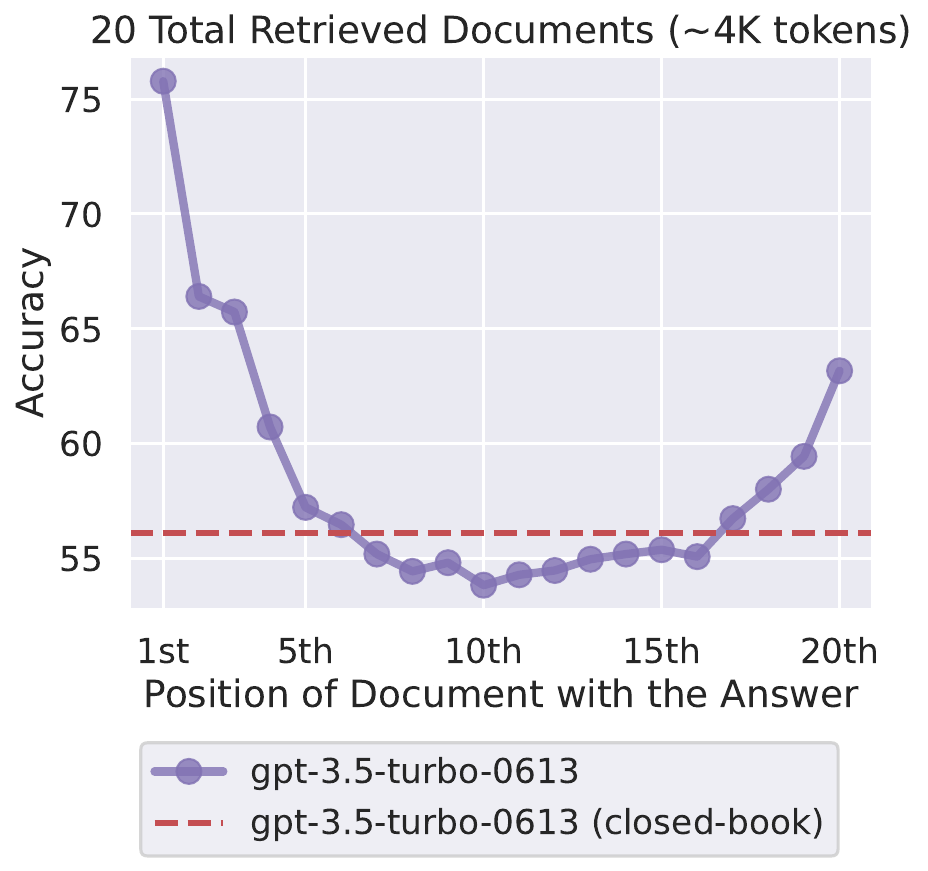
*Изменение местоположения релевантной информации (позиции отрывка, который отвечает на входной вопрос) в контексте входных данных языковой модели приводит к U-образной кривой производительности — модели лучше используют релевантную информацию, которая находится в самом начале (эффект первичности) или в конце её входного контекста (эффект недавности), а производительность значительно ухудшается, когда модели должны получать доступ и использовать информацию, расположенную в середине её входного контекста.*

Языковые модели стали важным и гибким строительным блоком в различных языковых технологиях, ориентированных на пользователя, включая разговорные интерфейсы, поиск и суммаризацию, а также совместное написание [Shuster et al., 2022; Thoppilan et al., 2022; Lee et al., 2022].  
Эти модели выполняют задачи нижнего уровня в основном через подсказки: вся релевантная спецификация задачи и данные для обработки форматируются как текстовый входной контекст, и модель возвращает сгенерированное текстовое завершение.  
Эти входные контексты могут содержать тысячи токенов, особенно когда языковые модели используются для обработки длинных документов (например, юридических или научных документов, истории разговоров и т. д.) или когда языковые модели дополняются внешней информацией (например, релевантными документами из поисковой системы, результатами запросов к базе данных и т. д.; [Petroni et al., 2020; Ram et al., 2023; Shi et al., 2023; Mallen et al., 2023; Schick et al., 2023]).

Обработка этих случаев использования требует, чтобы языковые модели успешно работали с длинными последовательностями.  
Существующие языковые модели обычно реализуются с помощью трансформеров [Vaswani et al., 2017], которые требуют памяти и вычислений, увеличивающихся квадратично в зависимости от длины последовательности.  
В результате трансформерные языковые модели часто обучались с относительно небольшими оконными контекстами (от 512 до 2048 токенов).  
Недавние улучшения в аппаратном обеспечении (например, более быстрые графические процессоры с большим объемом памяти) и алгоритмах [Dai et al., 2019; Dao et al., 2022; Poli et al., 2023; Rubin et al., 2023] привели к появлению языковых моделей с большими оконными контекстами (например, 4096, 32K и даже 100K токенов), но остается неясным, как эти модели с расширенным контекстом используют свои входные контексты при выполнении задач нижнего уровня.

Мы эмпирически исследуем этот вопрос с помощью контролируемых экспериментов с различными современными открытыми (MPT-30B-Instruct, LongChat-13B (16K)) и закрытыми (OpenAI's GPT-3.5-Turbo и Anthropic's Claude-1.3) языковыми моделями в условиях, требующих доступа и использования информации в пределах входного контекста.  
В частности, в наших экспериментах вносятся контролируемые изменения в размер входного контекста и положение релевантной информации в пределах входного контекста, и изучаются их эффекты на производительность языковой модели.  
Если языковые модели могут надежно использовать информацию в пределах длинных входных контекстов, то их производительность должна быть *минимально подвержена* влиянию положения релевантной информации в контексте входных данных.

Сначала мы экспериментируем с многодокументным вопросно-ответным анализом, который требует от моделей анализа предоставленных документов для нахождения релевантной информации и использования её для ответа на заданный вопрос; эта задача имитирует настройку генерации с дополнением поиска, лежащую в основе многих коммерческих приложений генеративного поиска и вопросно-ответного анализа (например, Bing Chat).  
В этом контексте мы контролируем (i)~длину входного контекста, изменяя количество документов в контексте входных данных (аналогично извлечению большего или меньшего количества документов в генерации с дополнением поиска), и (ii)~контролируем положение релевантной информации в пределах входного контекста, изменяя порядок документов, чтобы разместить релевантный документ в начале, середине или конце контекста.

Мы обнаруживаем, что изменение положения релевантной информации в контексте входных данных может существенно повлиять на производительность модели, что указывает на то, что текущие языковые модели не могут надежно получать доступ и использовать информацию в длинных входных контекстах.  
Более того, мы наблюдаем характерную U-образную кривую производительности (см. рисунок выше); производительность языковой модели наивысшая, когда релевантная информация находится в самом начале (эффект первичности) или в конце её входного контекста (эффект недавности), и производительность значительно ухудшается, когда модели должны получать доступ и использовать информацию в середине своих входных контекстов (§ QA Results).  
Например, когда релевантная информация размещена в середине её входного контекста, производительность GPT-3.5-Turbo на задаче многодокументного вопросно-ответного анализа ниже, чем её производительность при прогнозировании *без каких-либо документов* (т.е. в закрытой книге; 56.1%).  
Кроме того, мы обнаруживаем, что модели часто имеют идентичную производительность с их аналогами с расширенным контекстом, что указывает на то, что модели с расширенным контекстом не обязательно лучше используют свой входной контекст (§ QA Results).

Учитывая, что языковые модели испытывают трудности с извлечением и использованием релевантной информации в задаче многодокументного вопросно-ответного анализа, в какой степени языковые модели вообще могут *извлекать* из своих входных контекстов?  
Мы изучаем этот вопрос с помощью синтетической задачи извлечения ключевых значений, которая предназначена для минимального тестирования базовой способности извлекать совпадающие токены из входного контекста.  
В этой задаче моделям предоставляется коллекция пар ключ-значение в формате JSON, и они должны вернуть значение, связанное с определенным ключом.  
Подобно задаче многодокументного вопросно-ответного анализа, задача извлечения ключевых значений допускает контролируемые изменения длины входного контекста (добавление большего количества пар ключ-значение) и положения релевантной информации.  
Хотя некоторые модели выполняют синтетическую задачу извлечения ключевых значений идеально, другие модели испытывают трудности даже с простым извлечением совпадающих токенов, которые встречаются в середине их входного контекста, и продолжают демонстрировать U-образную кривую производительности.

Чтобы лучше понять, почему языковые модели испытывают трудности с надежным доступом и использованием информации в своих входных контекстах, мы изучаем роль архитектуры модели (только декодер против кодер-декодер), контекстуализации с учетом запроса и тонкой настройки инструкций (§ Why U-shape). Мы обнаруживаем, что:

- Кодер-декодер модели относительно устойчивы к изменениям положения релевантной информации в их входном контексте, но только при оценке последовательностей в пределах их максимальной длины последовательности на этапе обучения. При оценке последовательностей, превышающих те, что были видны во время обучения, мы наблюдаем U-образную кривую производительности (§ Architecture).
- Контекстуализация с учетом запроса (размещение запроса перед *и* после документов или пар ключ-значение) обеспечивает почти идеальную производительность в синтетической задаче извлечения ключевых значений, но минимально изменяет тенденции в многодокументном вопросно-ответном анализе (§ Pre-conditioning).
- Даже базовые языковые модели (т.е. без тонкой настройки инструкций) демонстрируют U-образную кривую производительности при изменении положения релевантной информации в контексте входных данных.

Наши результаты показывают, что предоставление языковым моделям более длинных входных контекстов — это компромисс: предоставление языковой модели большего объема информации может помочь ей выполнить задачу нижнего уровня, но также увеличивает объем контента, который модель должна анализировать, что может снизить точность.  
Чтобы лучше понять этот компромисс на практике, мы проводим тематическое исследование с моделями извлечения-читателя на открытом вопросно-ответном анализе (§ ODQA Case Study).  
В отличие от нашей контролируемой задачи многодокументного вопросно-ответного анализа, где контекст всегда содержит ровно *один* документ, который отвечает на вопрос, ни один или многие из топ $k$ документов могут не содержать ответа в настройке открытого вопросно-ответного анализа.  
Когда мы извлекаем из Википедии, чтобы ответить на запросы из NaturalQuestions-Open, мы обнаруживаем, что производительность модели насыщается задолго до насыщения извлечения, что указывает на то, что текущие модели не могут эффективно использовать дополнительные извлеченные документы — использование 50 документов вместо 20 извлеченных документов лишь незначительно улучшает производительность ($\sim$1.5% для GPT-3.5-Turbo и $\sim$1% для Claude-1.3).

Наш анализ дает лучшее понимание того, как языковые модели используют свой входной контекст, и вводит новые протоколы оценки для будущих моделей с длинным контекстом; чтобы утверждать, что языковая модель может надежно использовать информацию в пределах длинных входных контекстов, необходимо показать, что её производительность минимально подвержена влиянию положения релевантной информации в контексте входных данных (например, минимальная разница в наилучшей и наихудшей производительности).  
Чтобы способствовать дальнейшей работе по пониманию и улучшению того, как языковые модели используют свой входной контекст, мы выпускаем наш код и данные оценки.  
[https://nelsonliu.me/papers/lost-in-the-middle](https://nelsonliu.me/papers/lost-in-the-middle)

---

## Многодокументный вопросно-ответный анализ

### Экспериментальная установка

В задаче многодокументного вопросно-ответного анализа входные данные модели включают (i)~вопрос, на который нужно ответить, и (ii)~$k$ документов (например, отрывки из Википедии), где *ровно один* из документов содержит ответ на вопрос, а $k - 1$ «отвлекающих» документов не содержат.  
Эта задача требует от модели доступа к документу, содержащему ответ, в пределах её входного контекста и использования его для ответа на вопрос.

<!-- 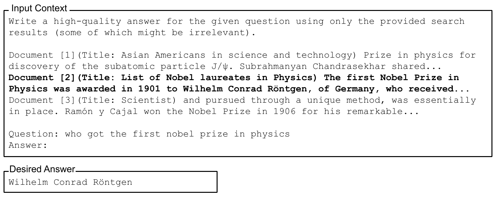 -->
#### Пример задачи многодокументного вопросно-ответного анализа

**Input Context**
>    Write a high-quality answer for the given question using only the provided search results (some of which might be irrelevant).
>
>    Document [1](Title: Asian Americans in science and technology) Prize in physics for discovery of the subatomic particle J/ψ. Subrahmanyan Chandrasekhar shared...
>
>    **Document [2](Title: List of Nobel laureates in Physics) The first Nobel Prize in Physics was awarded in 1901 to Wilhelm Conrad Röntgen, of Germany, who received...**
>
>    Document [3](Title: Scientist) and pursued through a unique method, was essentially in place. Ramón y Cajal won the Nobel Prize in 1906 for his remarkable...
>
>    Question: who got the first nobel prize in physics \
>    Answer:

**Desired Answer**
> Wilhelm Conrad Röntgen

*Документ, содержащий ответ, выделен для ясности.*

Мы реализуем эту задачу с данными из NaturalQuestions-Open [Lee et al., 2019; Kwiatkowski et al., 2019], которые содержат исторические запросы, отправленные в поисковую систему Google, в сочетании с аннотированными людьми ответами, извлеченными из Википедии.  
В частности, мы берем 2655 запросов, где аннотированный длинный ответ является абзацем (в отличие от списка или таблицы).  
Мы используем отрывки (кусочки не более 100 токенов) из Википедии в качестве документов в пределах наших входных контекстов.  
Для каждого из запросов нам нужен документ, содержащий ответ, и $k-1$ отвлекающих документов, которые не содержат ответа.  
Чтобы получить документ, который отвечает на вопрос, мы используем абзац Википедии, содержащий ответ из аннотаций NaturalQuestions.

Чтобы собрать $k-1$ отвлекающих документов, которые не содержат ответа, мы используем систему извлечения (Contriever, дообученную на MS-MARCO; [Izacard et al., 2021]) для извлечения $k-1$ отрывков из Википедии, которые наиболее релевантны запросу и не содержат ни одного из аннотированных ответов NaturalQuestions.

Чтобы модулировать положение релевантной информации в пределах входного контекста, мы изменяем порядок документов, чтобы изменить положение документа, содержащего ответ.

<!-- 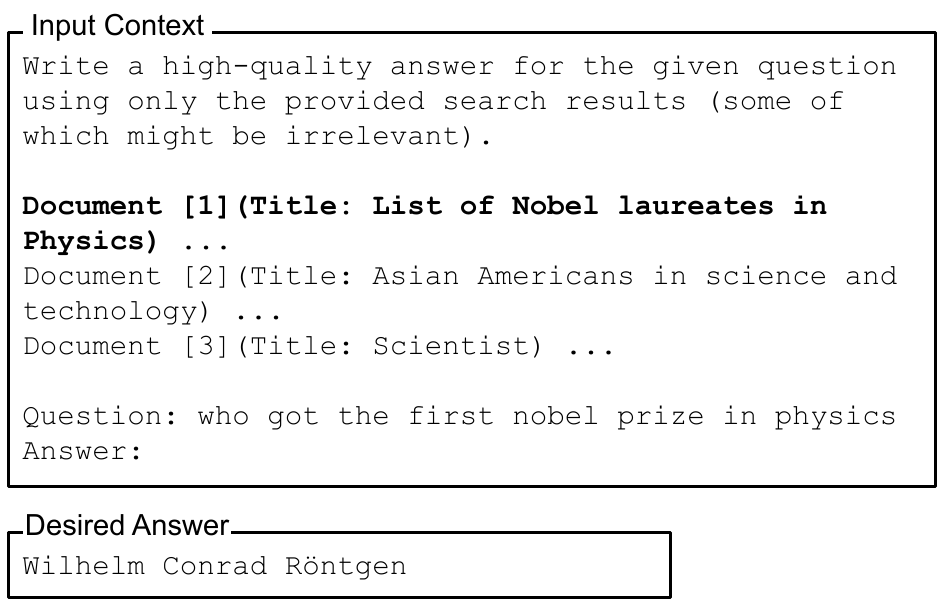 -->
#### Модуляция положения релевантной информации

**Input Context**
> Write a high-quality answer for the given question using only the provided search results (some of which might be irrelevant).
> 
> **Document [1](Title: List of Nobel laureates in Physics) ...** \
> Document [2](Title: Asian Americans in science and technology) ... \
> Document [3](Title: Scientist) ... 
> 
> Question: who got the first nobel prize in physics \
> Answer:


**Desired Answer**
> Wilhelm Conrad Röntgen


Чтобы модулировать длину входного контекста в этой задаче, мы увеличиваем или уменьшаем количество извлеченных документов, не содержащих ответа.


<!-- 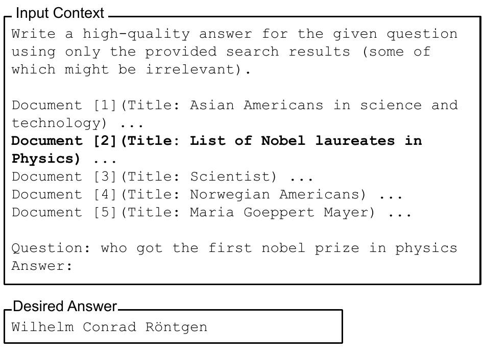 -->
#### Модуляция длины входного контекста

**Input Context**
> Write a high-quality answer for the given question using only the provided search results (some of which might be irrelevant).
> 
> Document [1](Title: Asian Americans in science and technology) ... \
> **Document [2](Title: List of Nobel laureates in Physics) ...** \
> Document [3](Title: Scientist) ... \
> Document [4](Title: Norwegian Americans) ... \
> Document [5](Title: Maria Goeppert Mayer) ...
> 
> Question: who got the first nobel prize in physics \
> Answer:

**Desired Answer**
> Wilhelm Conrad Röntgen


Следуя [Kandpal et al., 2022; Mallen et al., 2023], мы используем точность в качестве нашего основного показателя оценки, оценивая, появляется ли какой-либо из правильных ответов (как взято из аннотаций NaturalQuestions) в предсказанном выводе.

---

### Модели

Мы анализируем несколько современных открытых и закрытых языковых моделей.  
Мы используем жадное декодирование при генерации выводов и оставляем изучение других методов декодирования для будущей работы.  
Мы используем стандартный набор подсказок для каждой модели.

**Открытые модели:**  
- MPT-30B-Instruct (максимальная длина контекста 8192 токена, ALiBi позиционирование)
- LongChat-13B (16K) (расширенное окно контекста LLaMA-13B до 16384 токенов)

**Закрытые модели:**  
- GPT-3.5-Turbo (4K токенов) и GPT-3.5-Turbo (16K)
- Claude-1.3 (8K токенов) и Claude-1.3 (100K токенов)
- GPT-4 (8K) — только подмножество экспериментов

---

### Результаты и обсуждение

Мы экспериментируем с входными контекстами, содержащими 10, 20 и 30 документов.  
Ниже — производительность многодокументного вопросно-ответного анализа при изменении положения релевантной информации в пределах входного контекста.

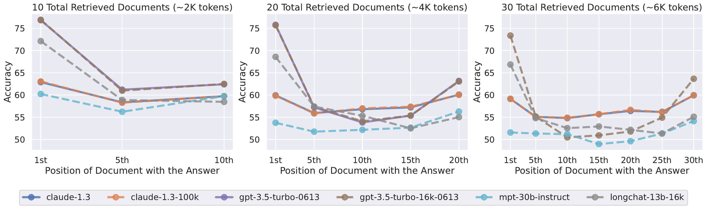

#### Таблица: Точность языковых моделей в закрытой книге и оракульской настройке

| Модель              | Закрытая книга | Оракул  |
|---------------------|:-------------:|:-------:|
| LongChat-13B (16K)  | 35.0%         | 83.4%   |
| MPT-30B-Instruct    | 31.5%         | 81.9%   |
| GPT-3.5-Turbo       | 56.1%         | 88.3%   |
| GPT-3.5-Turbo (16K) | 56.0%         | 88.6%   |
| Claude-1.3          | 48.3%         | 76.1%   |
| Claude-1.3 (100K)   | 48.2%         | 76.4%   |

#### Основные выводы

- **Производительность максимальна, когда релевантная информация в начале или конце контекста.**  
  U-образная кривая производительности: модели лучше используют релевантную информацию, находящуюся в начале (эффект первичности) или в конце (эффект недавности) контекста, и производительность значительно ухудшается, когда информация в середине.
- **Модели с расширенным контекстом не обязательно лучше используют входной контекст.**  
  Производительность между обычной и расширенной версией модели почти идентична, если входной контекст помещается в их окно.

---

## Насколько хорошо языковые модели могут извлекать из входных контекстов?

Учитывая, что языковые модели испытывают трудности с извлечением и использованием информации из середины их входных контекстов в задаче многодокументного вопросно-ответного анализа, в какой степени они могут просто *извлекать* из входных контекстов?  
Мы изучаем этот вопрос с помощью синтетической задачи извлечения ключевых значений.

<!-- 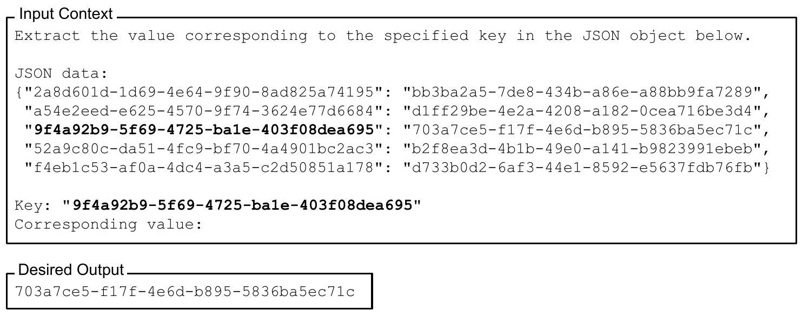 -->

**Input Context**
> Extract the value corresponding to the specified key in the JSON object below.
> 
> JSON data:
```json
{"2a8d601d-1d69-4e64-9f90-8ad825a74195": "bb3ba2a5-7de8-434b-a86e-a88bb9fa7289",
 "a54e2eed-e625-4570-9f74-3624e77d6684": "d1ff29be-4e2a-4208-a182-0cea716be3d4",
 "9f4a92b9-5f69-4725-ba1e-403f08dea695": "703a7ce5-f17f-4e6d-b895-5836ba5ec71c", // <--
 "52a9c80c-da51-4fc9-bf70-4a4901bc2ac3": "b2f8ea3d-4b1b-49e0-a141-b9823991ebeb",
 "f4eb1c53-af0a-4dc4-a3a5-c2d50851a178": "d733b0d2-6af3-44e1-8592-e5637fdb76fb"}
```
> Key: "**9f4a92b9-5f69-4725-ba1e-403f08dea695**"
> Corresponding value:

**Desired Output**
> 703a7ce5-f17f-4e6d-b895-5836ba5ec71c


### Экспериментальная установка

Входные данные включают:
- сериализованный объект JSON с $k$ парами ключ-значение (UUID)
- ключ, для которого нужно вернуть значение

Мы измеряем точность, оценивая, появляется ли правильное значение в предсказанном выводе.

### Результаты

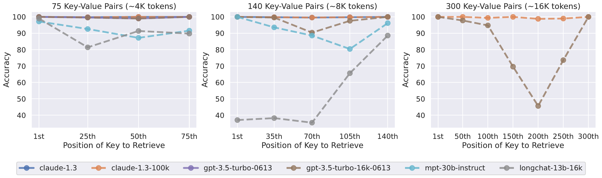

- Claude-1.3 и Claude-1.3 (100K) почти идеально выполняют задачу на всех длинах контекста.
- GPT-3.5-Turbo, GPT-3.5-Turbo (16K) и MPT-30B-Instruct испытывают трудности, особенно при большом количестве пар.
- U-образная кривая производительности сохраняется: наименьшая точность — при необходимости извлекать из середины контекста.

---

## Почему языковые модели не устойчивы к изменениям положения релевантной информации?

Мы исследуем роль архитектуры модели, контекстуализации с учетом запроса и тонкой настройки инструкций.

### Влияние архитектуры модели

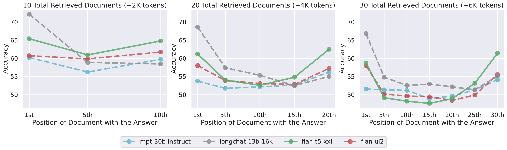

- Кодер-декодер модели (Flan-UL2, Flan-T5-XXL) устойчивы к изменению позиции релевантной информации, если длина последовательности не превышает ту, что была на обучении.
- При более длинных последовательностях появляется U-образная кривая.

### Влияние контекстуализации с учетом запроса

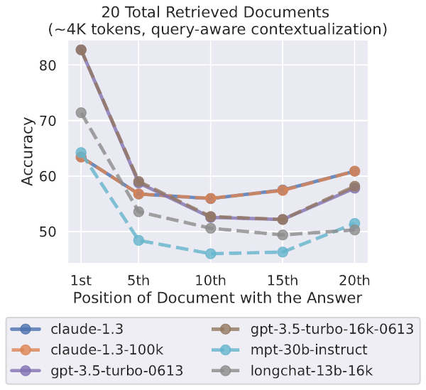

- Размещение запроса перед *и* после данных почти не влияет на тенденции в многодокументном вопросно-ответном анализе, но помогает в синтетической задаче извлечения ключевых значений.

### Влияние тонкой настройки инструкций

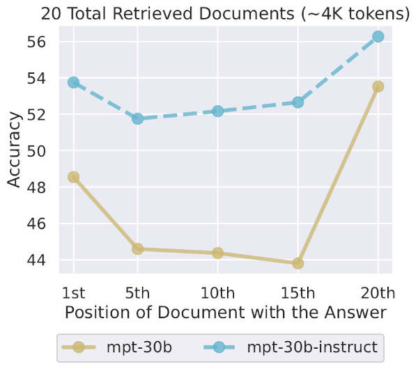

- U-образная кривая наблюдается как у базовой модели, так и у модели после тонкой настройки инструкций.
- Тонкая настройка инструкций слегка уменьшает разницу между наилучшей и наихудшей производительностью.

---

## Всегда ли больше контекста лучше? Тематическое исследование с открытым вопросно-ответным анализом

- Предоставление языковой модели большего объема информации может помочь, но также увеличивает объем контента для анализа, что может снизить точность.
- В экспериментах с NaturalQuestions-Open производительность модели насыщается задолго до насыщения извлечения: использование 50 документов вместо 20 улучшает точность лишь на 1–1.5%.

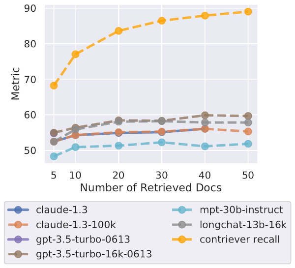

---

## Связанные работы

### Языковые модели с длинным контекстом

Много работ посвящено масштабированию трансформеров по длине контекста: модификации внимания (рекуррентность, аппроксимации, свертки, линейные RNN), ускоренные реализации (FlashAttention), отказ от внимания (RWKV, S4, Hyena).  
Оценка часто проводится по перплексии, но точный доступ к знаниям на длинных контекстах — отдельная задача.

### Как языковые модели используют контекст?

Ранние работы показали, что LSTM используют долгосрочный контекст все менее эффективно; внимательные LSTM склонны к недавности; трансформеры часто не используют долгосрочный контекст эффективно; длинный контекст помогает только для некоторых токенов.

### Эффект серийной позиции

U-образная кривая соответствует эффекту серийной позиции в психологии: люди лучше запоминают первые и последние элементы списка.  
В трансформерах, несмотря на техническую возможность извлекать любой токен, наблюдается аналогичный эффект.

---

## Заключение

Мы эмпирически изучаем, как языковые модели используют длинные входные контексты.  
Показываем, что производительность моделей значительно ухудшается при изменении положения релевантной информации — особенно в середине длинных контекстов.  
Проводим исследование роли архитектуры, контекстуализации с учетом запроса и тонкой настройки инструкций.  
В тематическом исследовании ODQA обнаруживаем, что производительность насыщается задолго до насыщения извлечения.  
Наши результаты дают лучшее понимание того, как языковые модели используют контекст, и предлагают новые протоколы оценки для будущих моделей с длинным контекстом.
