В прошлом году моя тоненькая печька начала прогарать. В какой-то момент, сидя на полке можно было наблюдать как в ней горит пламя прямо через прогаревшие щели.
До этого я уже ремонтировал в ней отвалившуюся пеегородку, посадив её на уголки ботами, но диагноз был однозначным: печь пора менять.

Найти готовую печь для бани на Кипре казалось нереальной затей, а заказать сварку нереальной по деньгам.
Кроме того моя текущая печь органично вписывалась в габориты моей бани и хотелось сохранить эту гармонию.
Решение было принято: буду варить себе новую печку.
Кроме того, эта идея обещала принести массу удовольствия от процесса.

Я сам не настящий сварщик. Варить меня когда то учил отец. Я немного баловался электродной сваркой, но ниего серьезного никогда не делал. Но жизнь заставит.

Первым делом купил MIG проволочный сварочник в Lidl и маску, чтообошлось мне примерно в 100 €

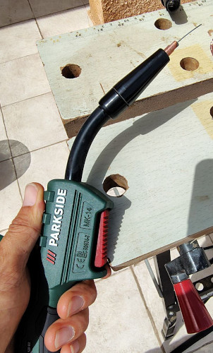
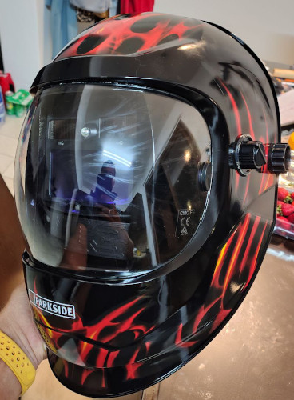

На металобазе нашёл 4мм листовое железо. Оно продавалось листами 2x1 м² пришлось купить лист целиком.
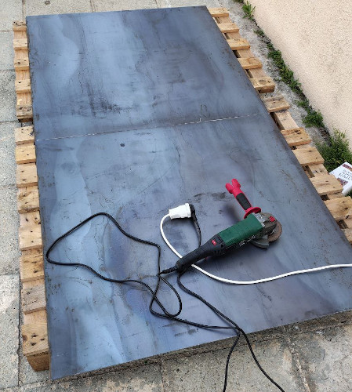
Лист оказался неподъёмным. Что бы его поднять пришлось сразу распилить попалам.
Лист обошёлся ещё в примерно 100 €. Половину этого листа я потом удачно продал за 50 €.
Ну и купил сразу паку катушек со сварочной проволокой.
Итого себистоемость моей печки можно условно считать ~200 €

Немного потренировался и нача варить.

Габариты печки я хотел сделать такими же, как моя предыдущая печь, что бы использовать кожух от нержавейки от старой печи и стеклянную дверку. И что бы она вписалась в мою баню также органично, как старая печка.

Но решил добавить изюминку: дожиг перолизных газов.
Рассчитал все габариты и получилась вот такая схема
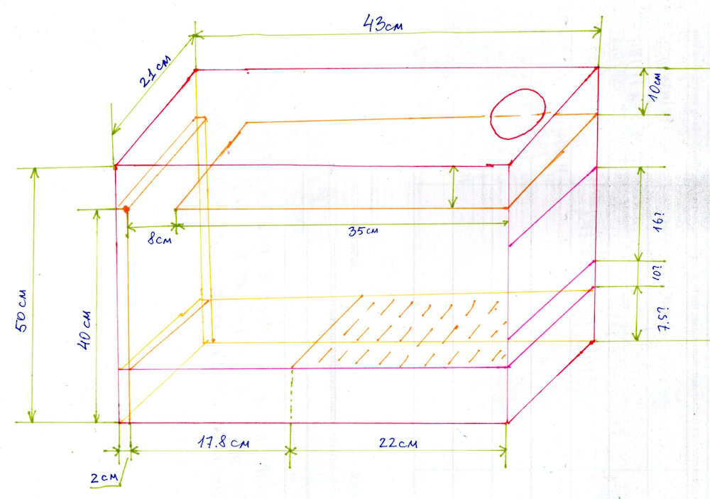
В чем здесь суть: задняя стенка двойная. Поласть шириной 2 см. Через неё с низу печки, из внешнего пространства поступает воздух прямо в камеру дожига. При этом воздух разогревается от горящих дров и поступает разогретый, не остужая газовоздушную смесь и дополнительно поджигая её. ТАким образом в камере дожига происходит сбственно дожиг и горение. Это дополнительно поавшает температуру непосредственно под верней перекладиной на которой лежат камни.

Важно что бы воздух поступал ровно на входе камеры дожига.

Был некоторый риск, что схема не сработает. Но я решил, что если что то пойдёт нетак, то просто закрою входное отверстие или в крайнем случае заварю его. В принципе риск был не большой и оправданный.

По итогу всё плучилось очень даже хорошо. Об этом ниже.

Вот немного фоток процесса изготовления:

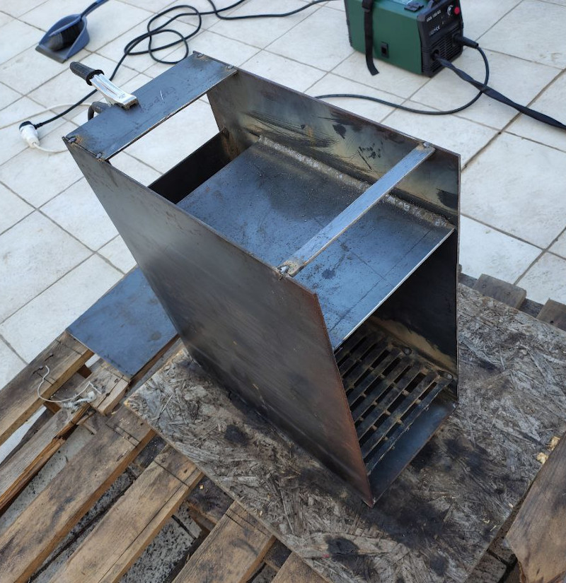
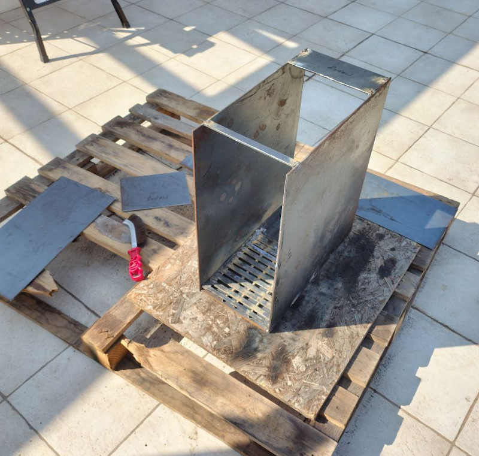
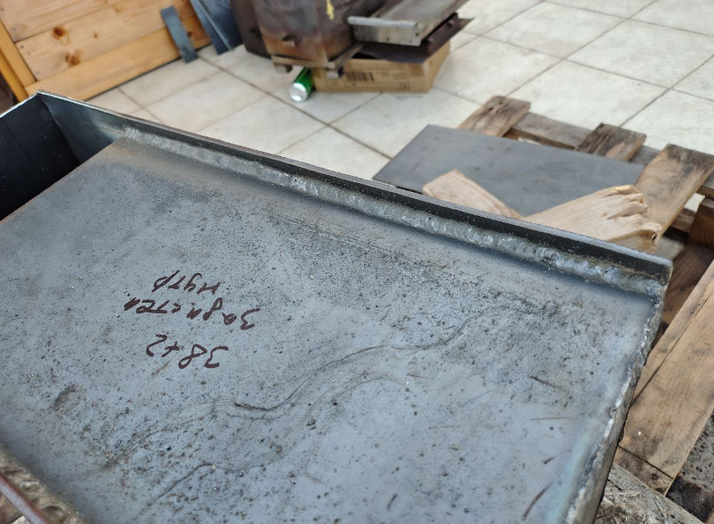
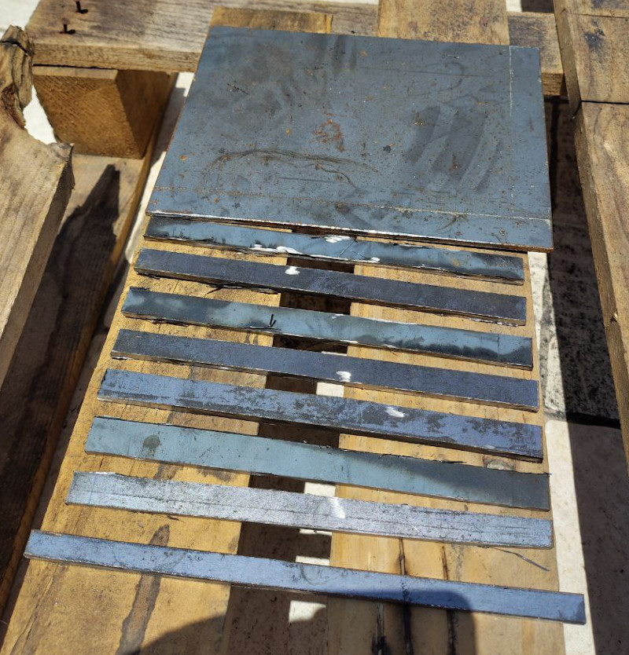

Сделал съёмную карсзину для камней:
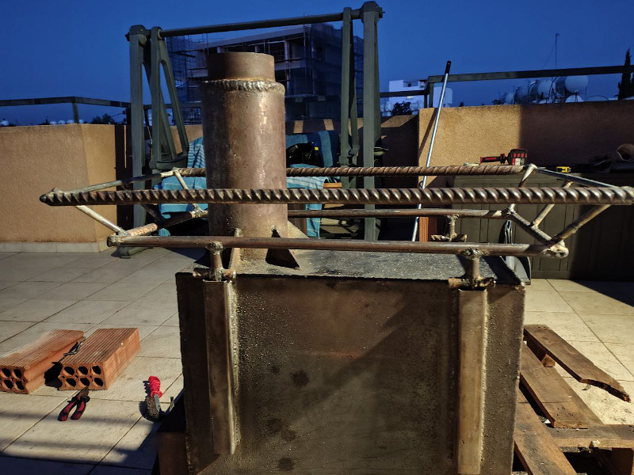
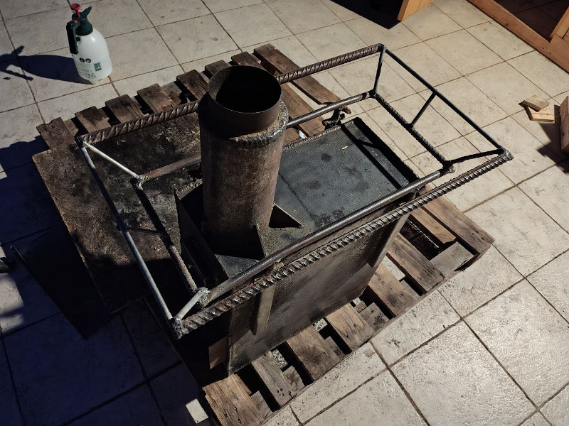

А на верхнюю перегородку приварил рёбра жесткости, которые одновременно являются дополнительными радиаторами:
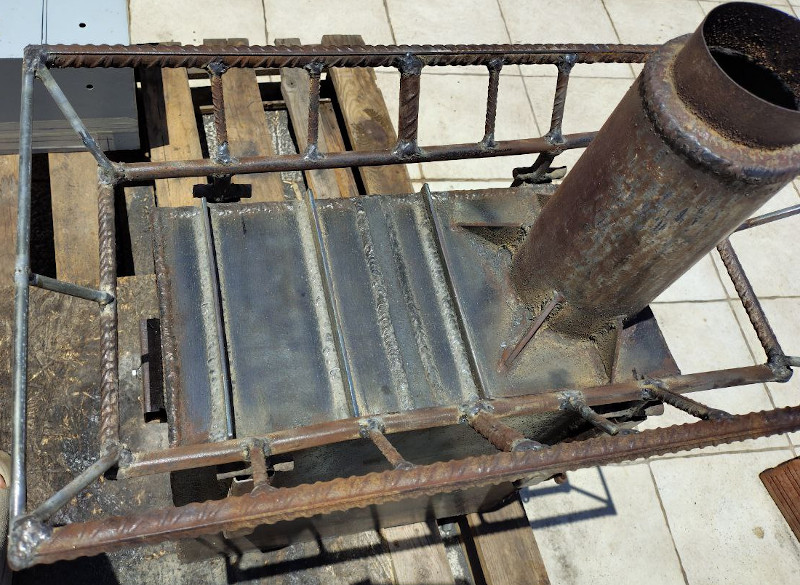
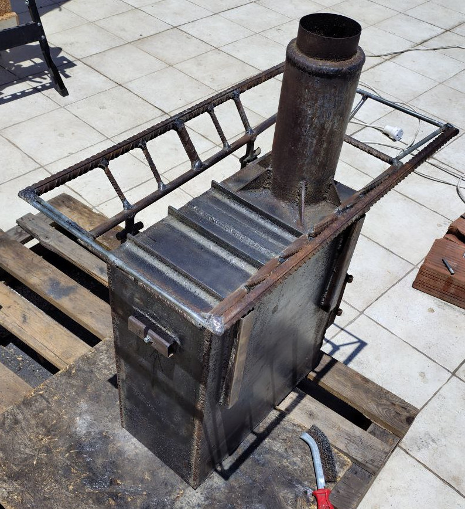
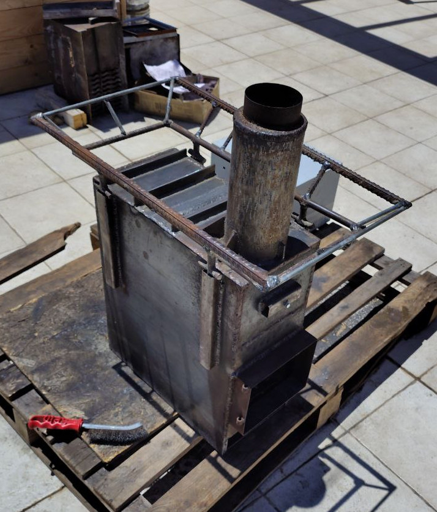

ПЕрвые испытания проводил на улице
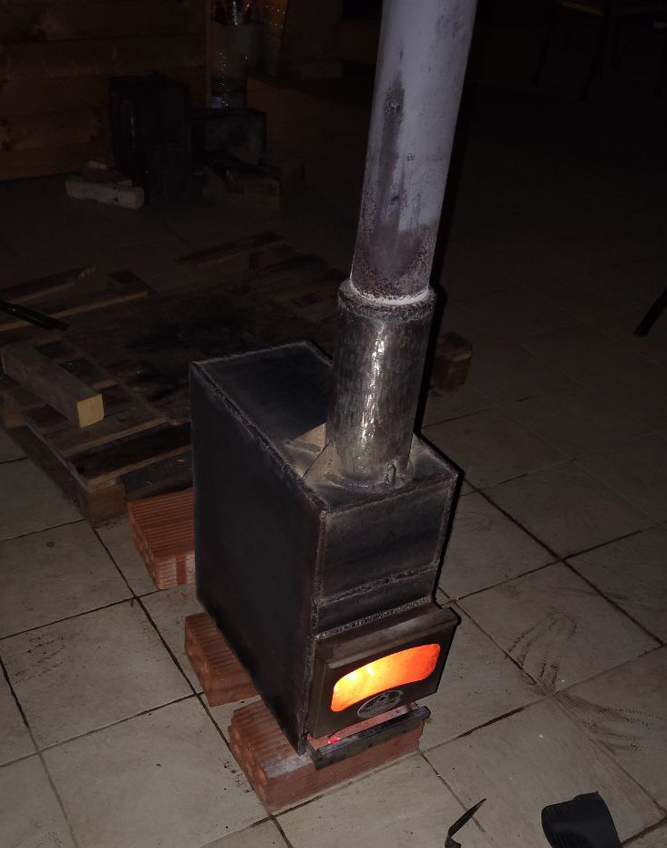

После прогрева дыма вообще не видно
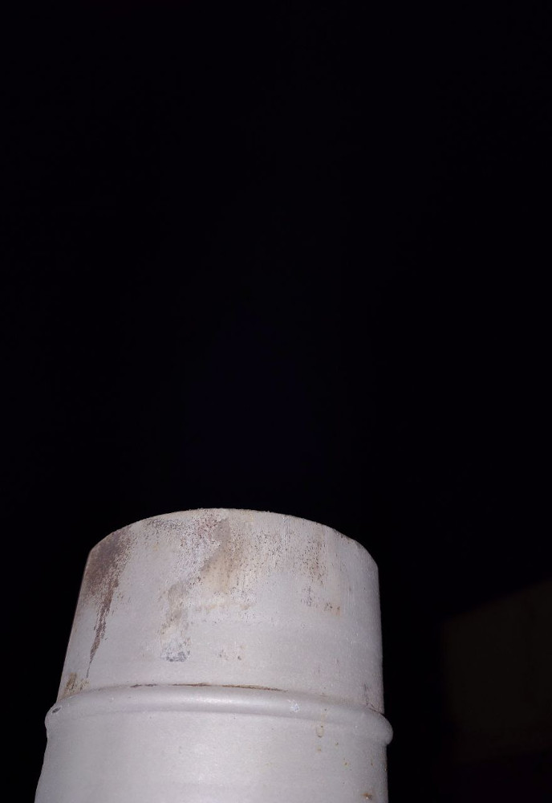

Сейчас печь уже установлена у меня в бане и выглядит вот так:
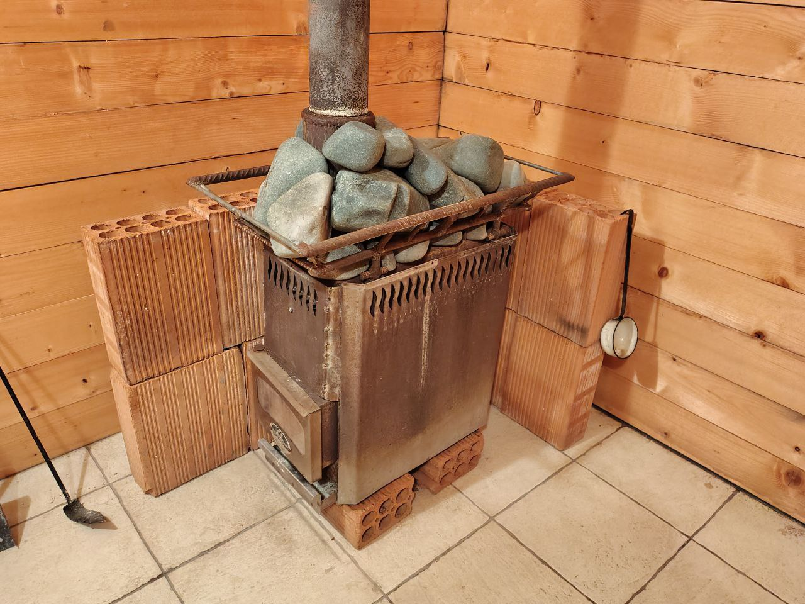

прогревается довольно быстро. ЗАметно быстрее предыдущей печи. После прогрева видимый дым полностю исчезает.
И как будто даже золы меньше стало. Или я просто стал тратить меньше дров. 
Из минусов камни ближе к задней стенке прогреваются заметно хуже. Основной жар чуть дальше. Видимо это связано с динамикой горения. Я не специализируюсь на инженирии горящих газов. Допускаю, что мог сделать не оптимально.

Ну в общем, я очень доволен результатом. Это был в каком то смсе эксперемент. И он удался.
