Решил я обновить свой ноутбук — увеличить память, да выяснилось, что на HP ProBook 4710s доступ к внутренностям организован не так, как у большинства других моделей, а совершенно через другое место. Поэтому выкладываю здесь инструкцию по открытию этого ноутбука.

**Шаг 1:**

Снимаем аккумулятор и откручиваем 5 болтов под ним:

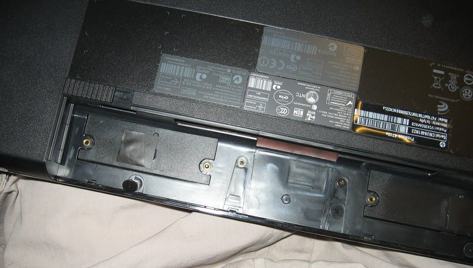

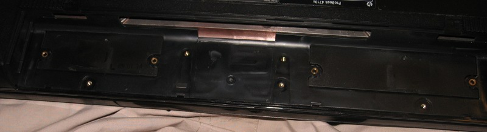

**Шаг 2:**

Затем откручиваем 2 болта на задней части ноутбука:

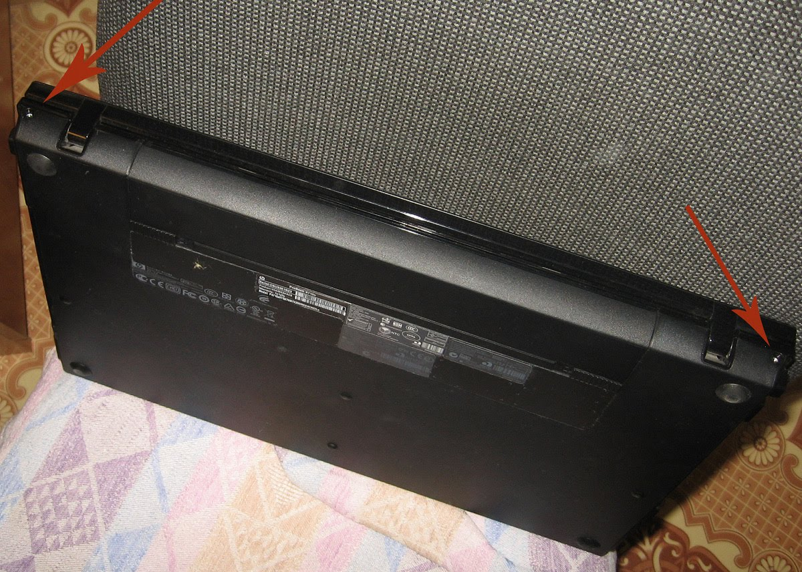

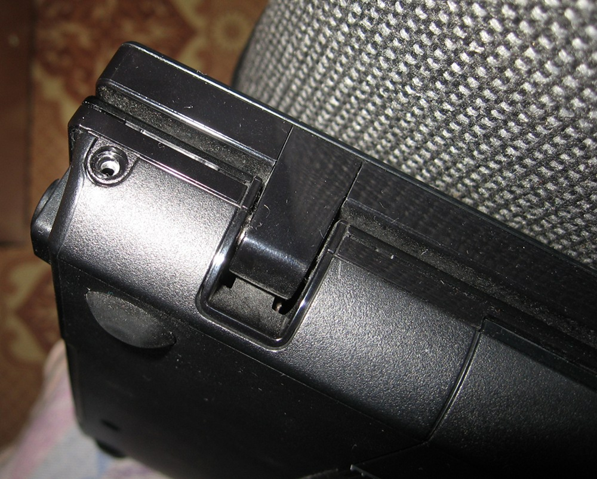

Складываем все шурупы в одном месте, чтобы не потерять:

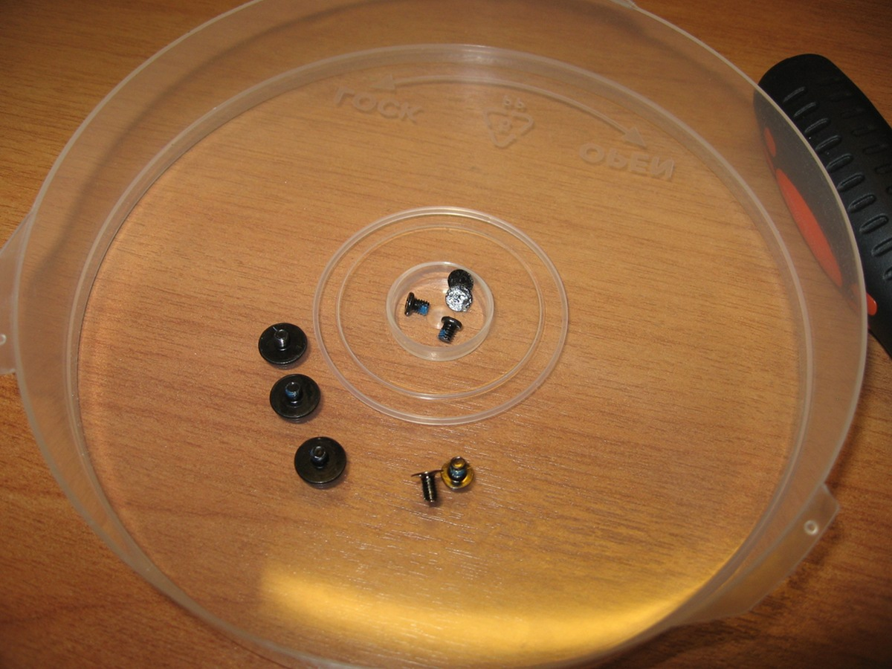

**Шаг 3:**

Толчком от себя снимаем заднюю часть верхней панели (ту, на которой динамики):

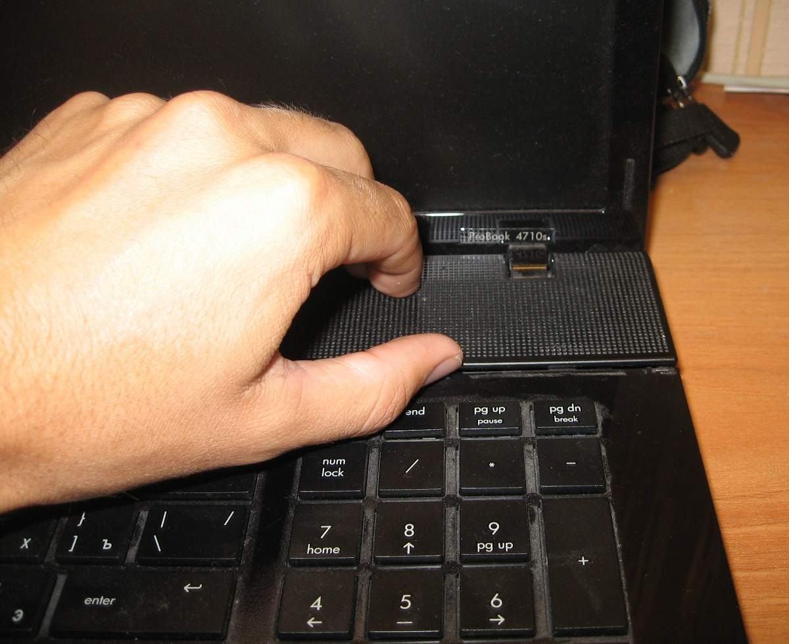

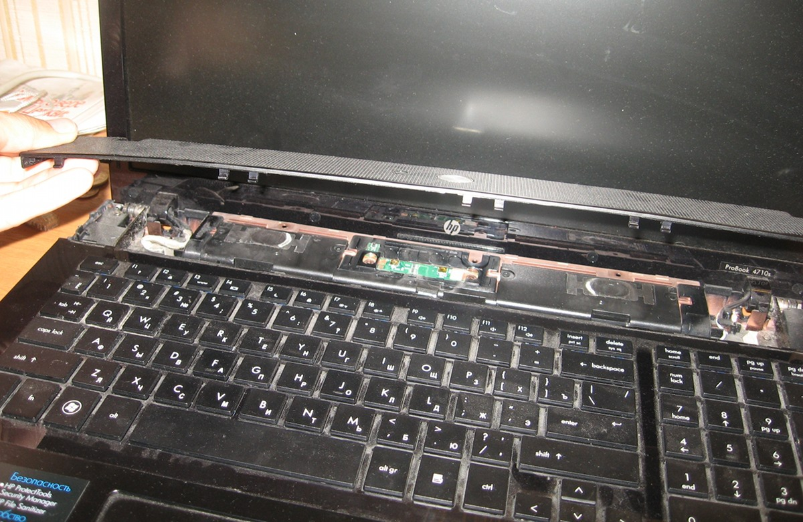

Эту часть можно полностью удалить, чтобы не мешала:

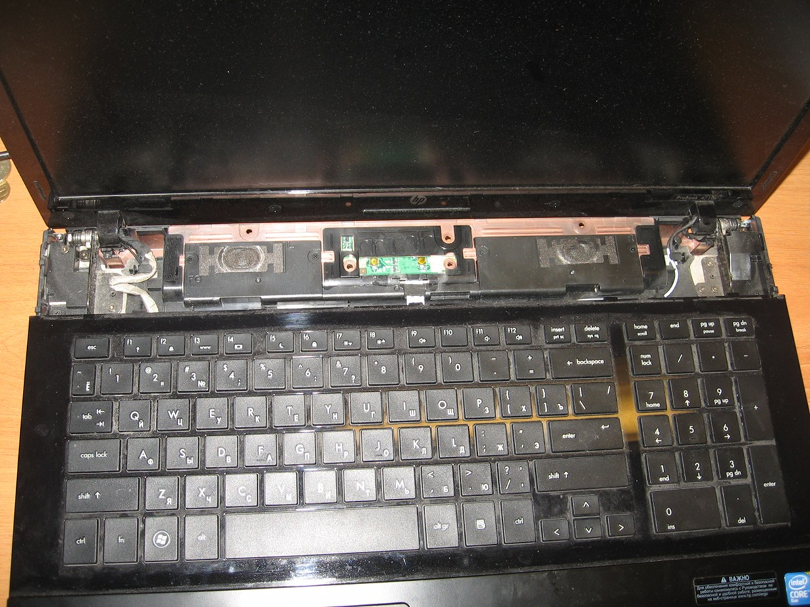

**Шаг 4:**

Далее у нас открывается доступ к болтам крепления клавиатуры:

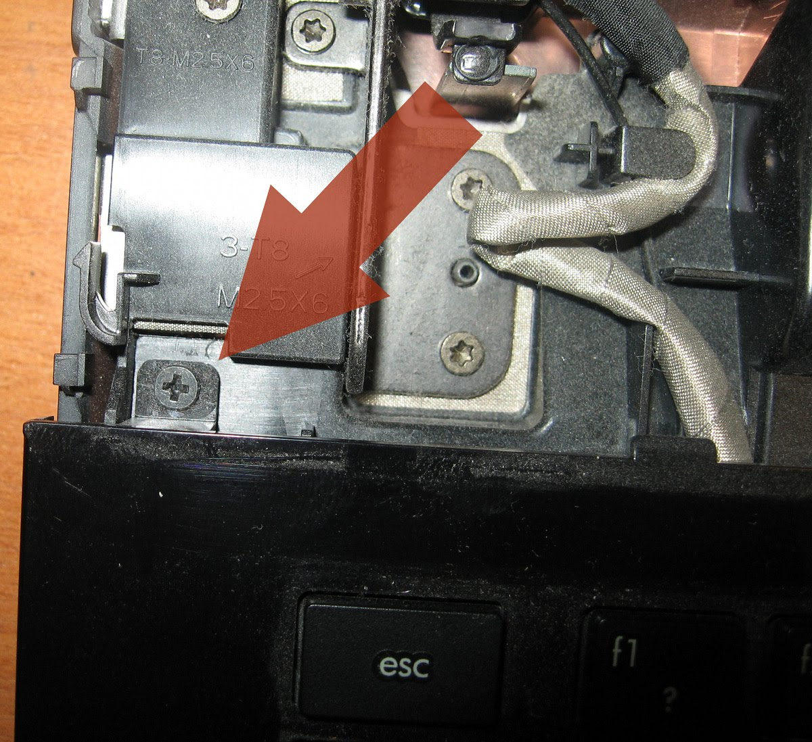

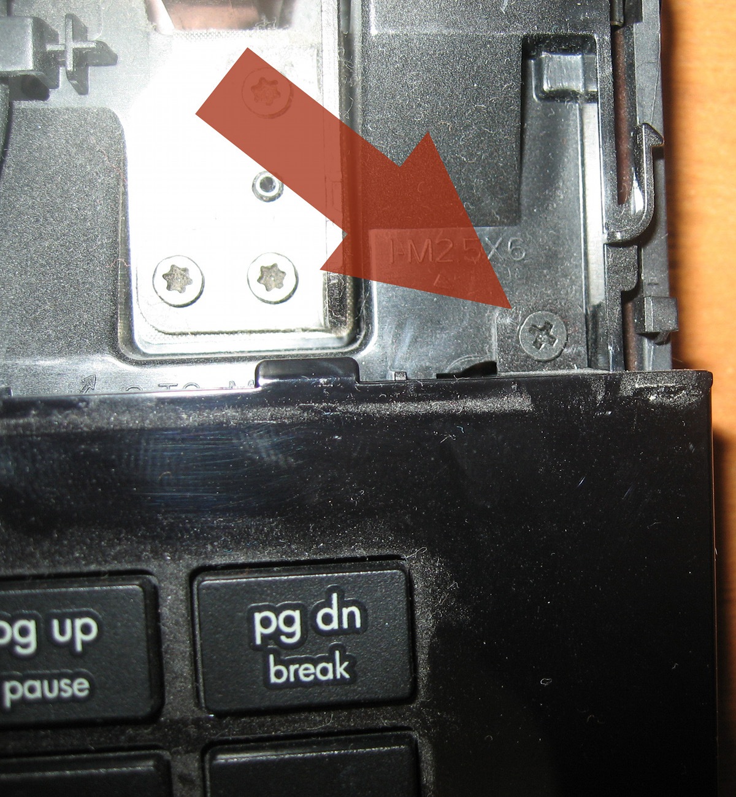

Их нужно открутить и также толчком от себя (без лишних усилий, это всё же не советская техника — можно и сломать) отделяем клавиатуру:

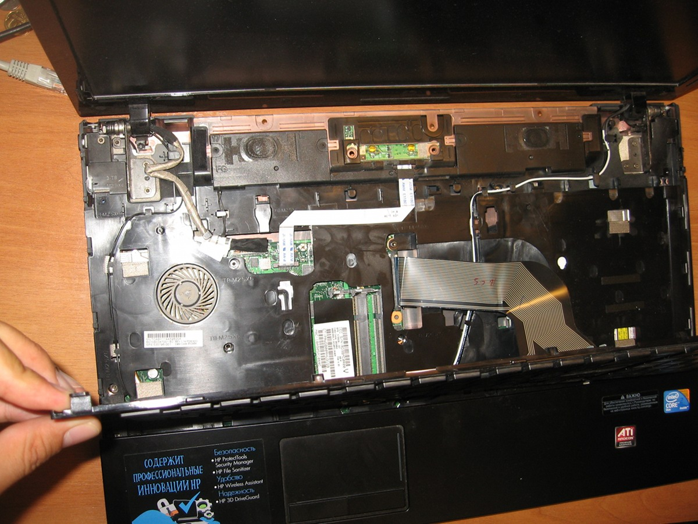

Вуаля, у нас появился доступ к оперативной памяти:

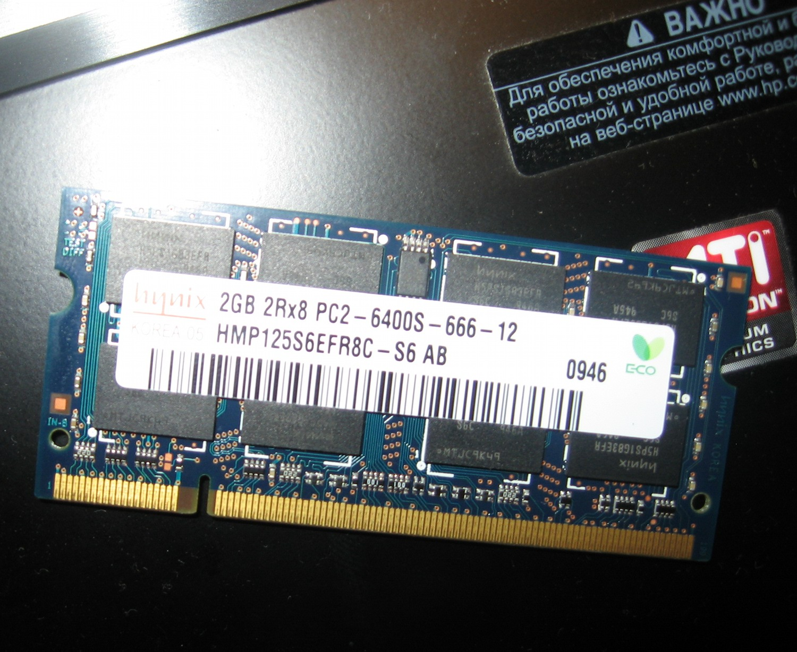

А дальше я не полез.

Собирается всё, естественно, в обратном порядке.
