Сегодня наконец-то пришла моя рыбацкая посылка из Гонконга.

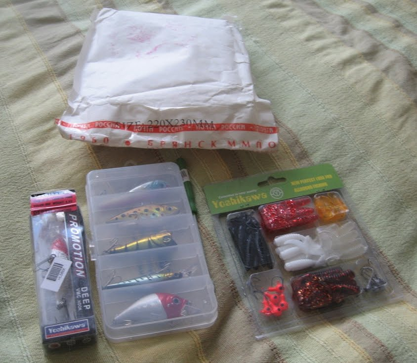

А именно, сделал небольшой пробный заказ на китайском сайте [focalprice.com](http://www.focalprice.com/detail_HL568X.html).  
До этого заказывал только на dealextreme.com.

Заказывал:

1. [Воблер](http://www.focalprice.com/detail_HL568X.html)
2. [Набор воблеров](http://www.focalprice.com/detail_HL555X.html)
3. [Набор виброхвостов](http://www.focalprice.com/detail_HL289X.html)
4. [Доставалку крючка из щучьей пасти](http://www.focalprice.com/detail_HL332G.html)

Шло около месяца, хотя я надеялся, что придет быстрее. Рыболовный сезон откроется не скоро, но тем не менее стоит учитывать. Отправили на следующий день после заказа — это, безусловно, плюс. В делекстриме бывает, что по две недели ждёшь отправки.

Качество товара вполне ожидаемое. Примерно то же самое продаётся у нас в 90% рыбацких магазинов, но за большие деньги.

Воблер пришёл другой расцветки. Я заказывал жёлтого цвета, пришёл серебристый с красной башкой:

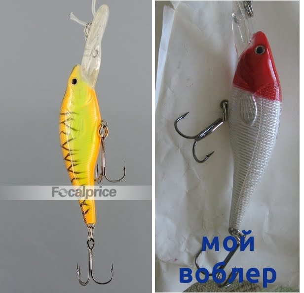

Виброхвосты, я ожидал, должны были быть побольше. Но тут уж сам виноват — на сайте размеры указаны. Хотя, впрочем, я не расстроился. Маленькую рыбу тоже нужно чем-то ловить.

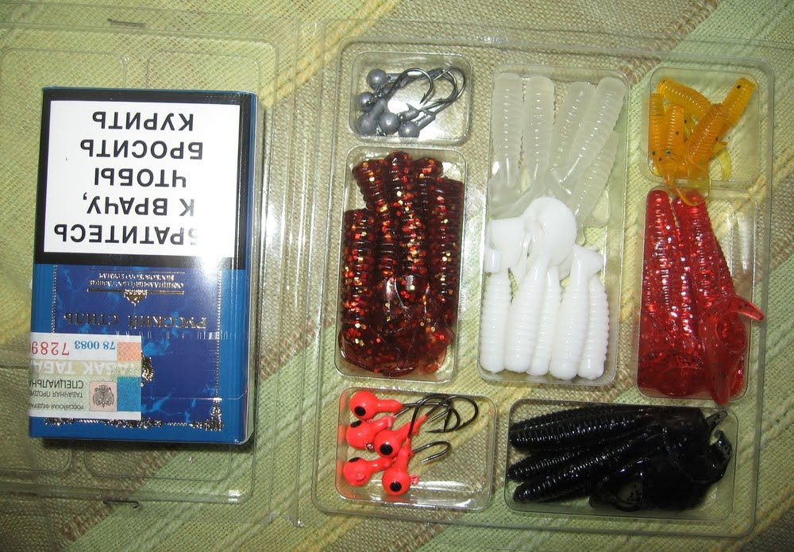

Джиги, как видно, тоже маленькие — грамм по пять.

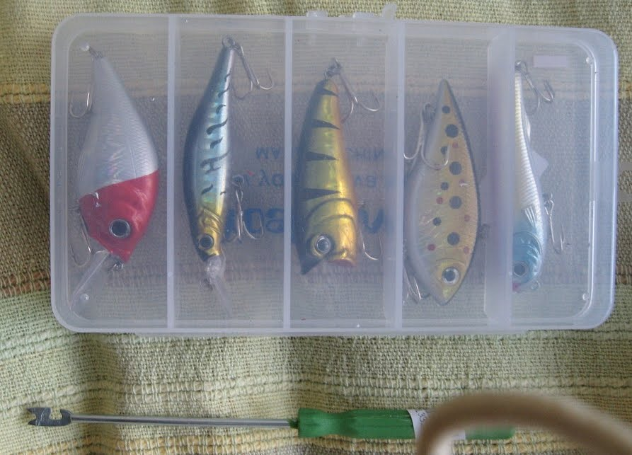
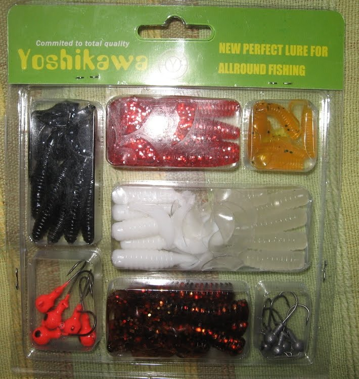

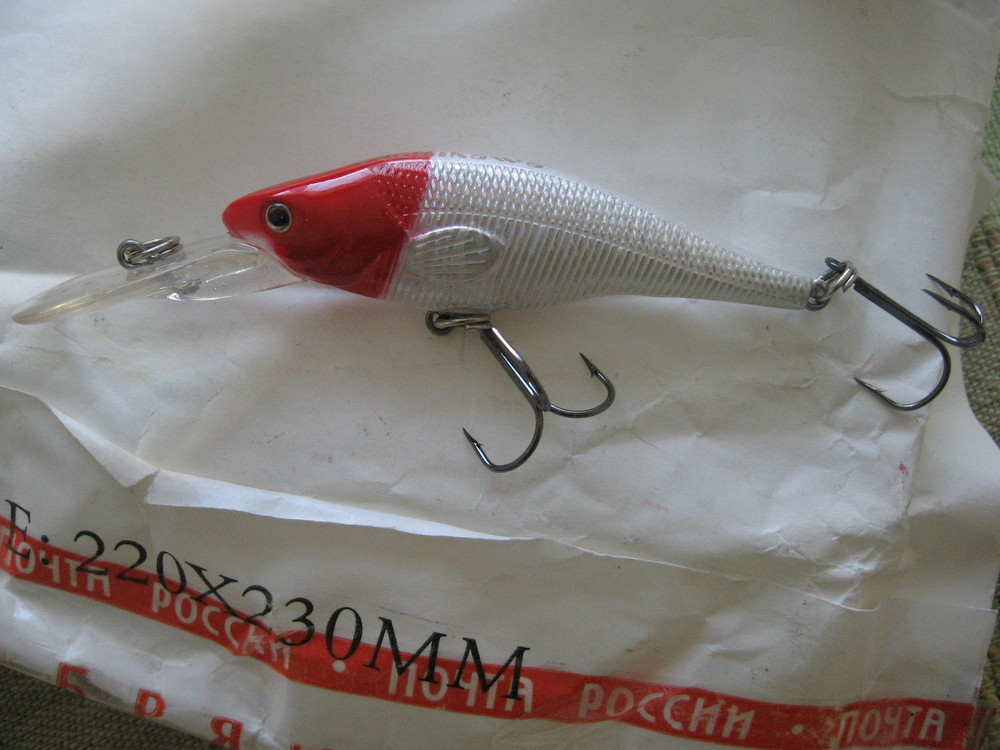
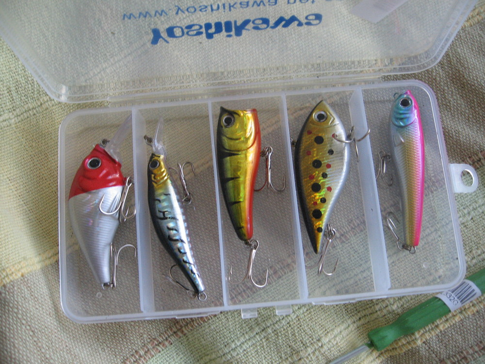

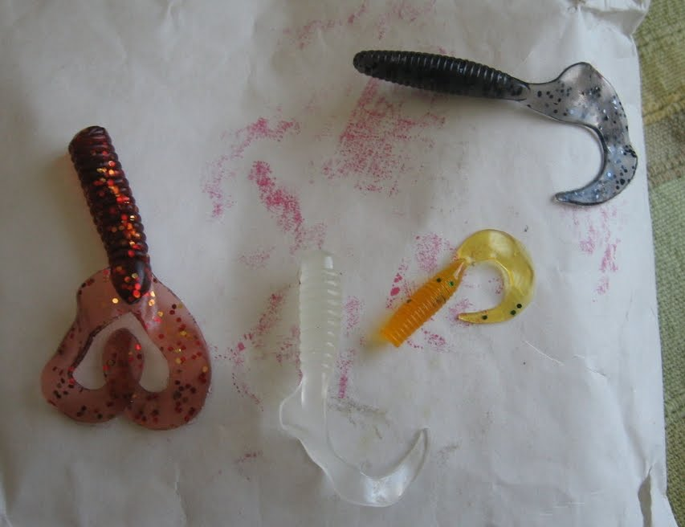
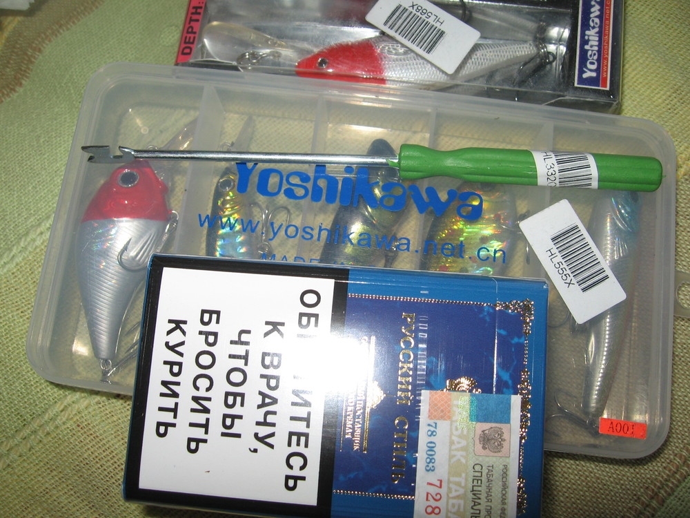

Также обратил внимание, что посылка почему-то шла через Брянск, и на Брянской таможне её вскрывали:

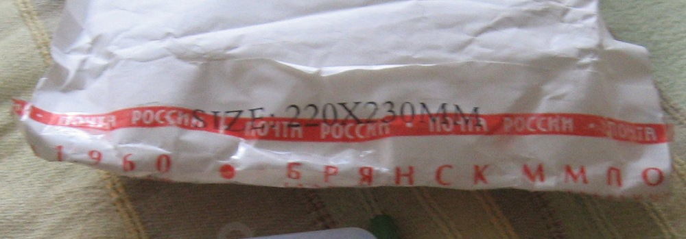
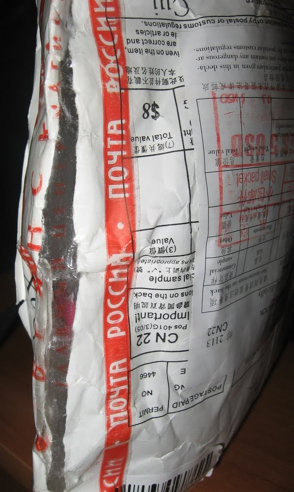
