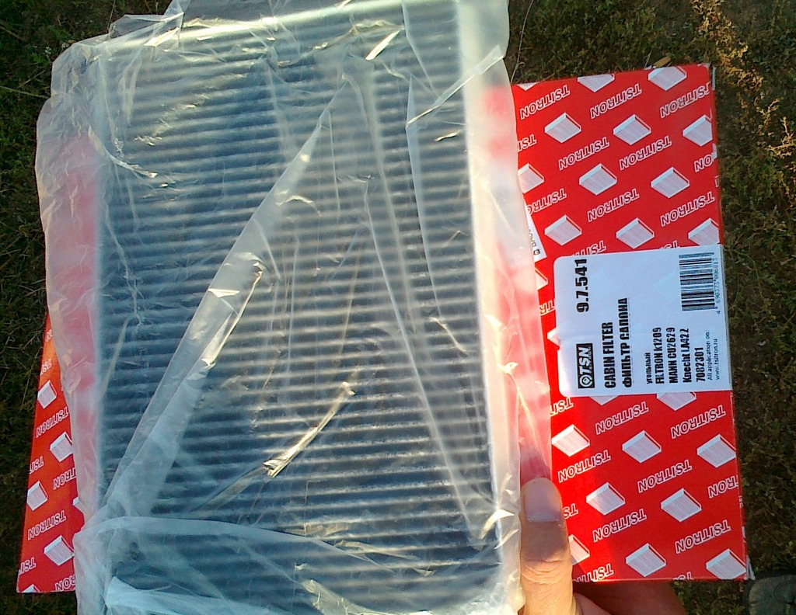
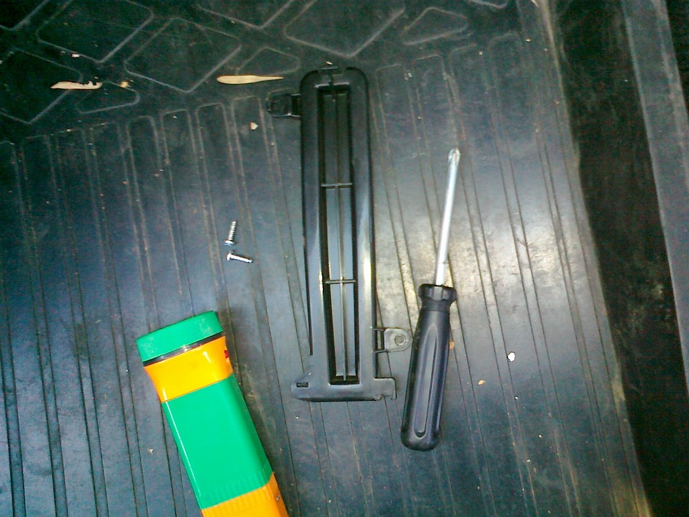
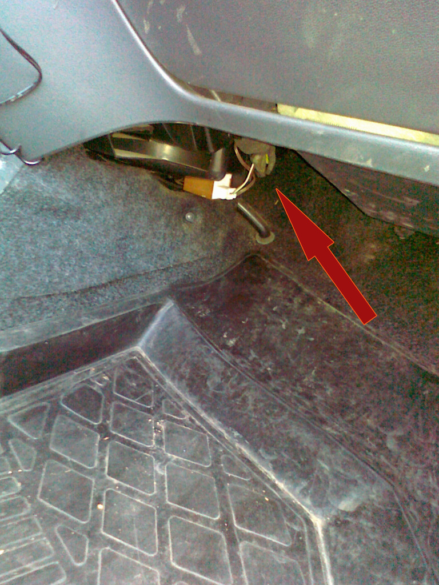
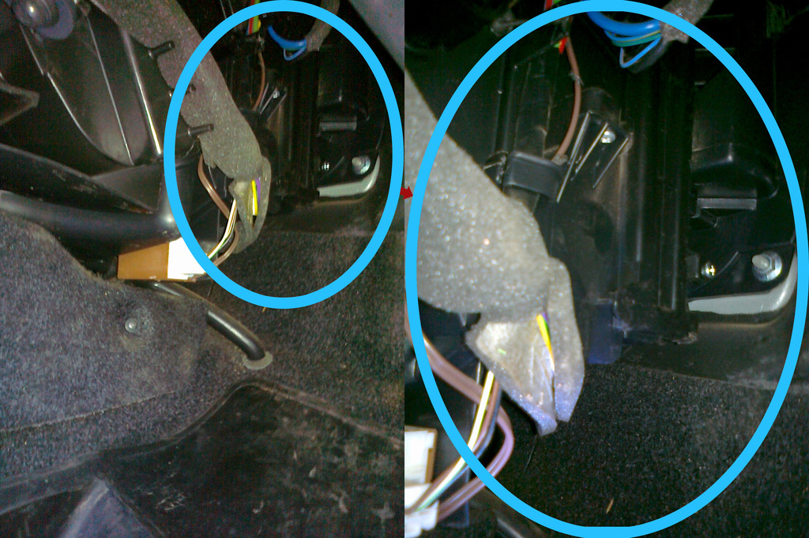
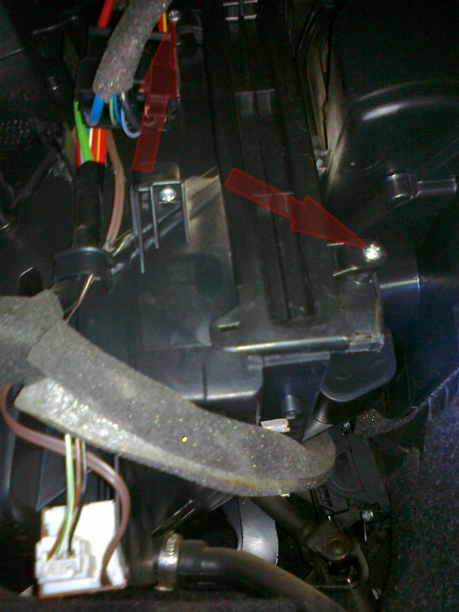
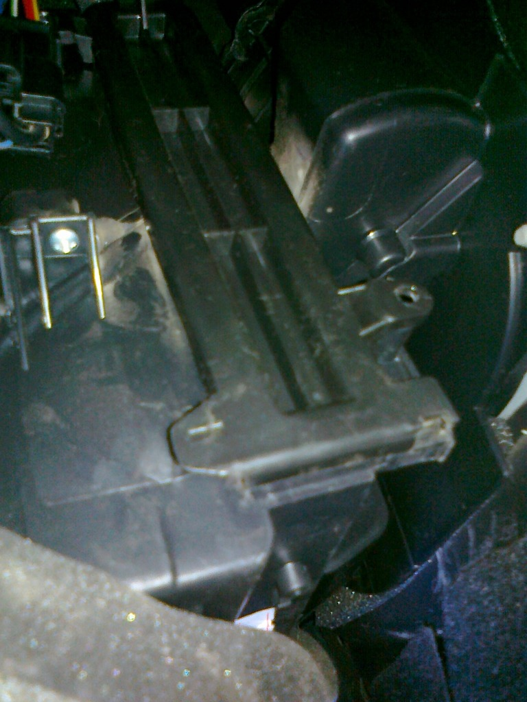
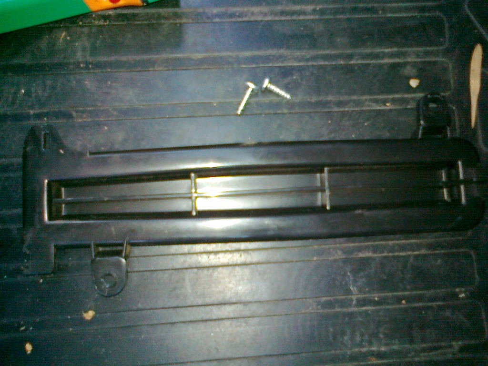
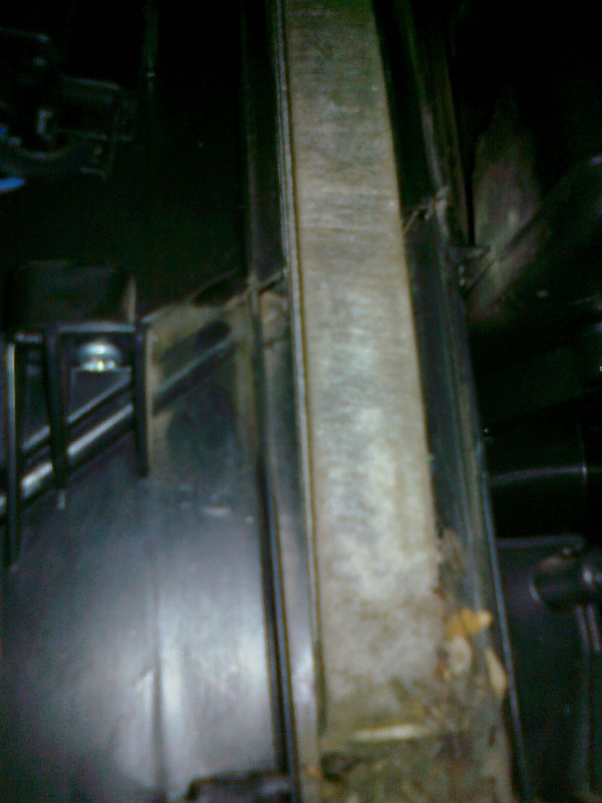
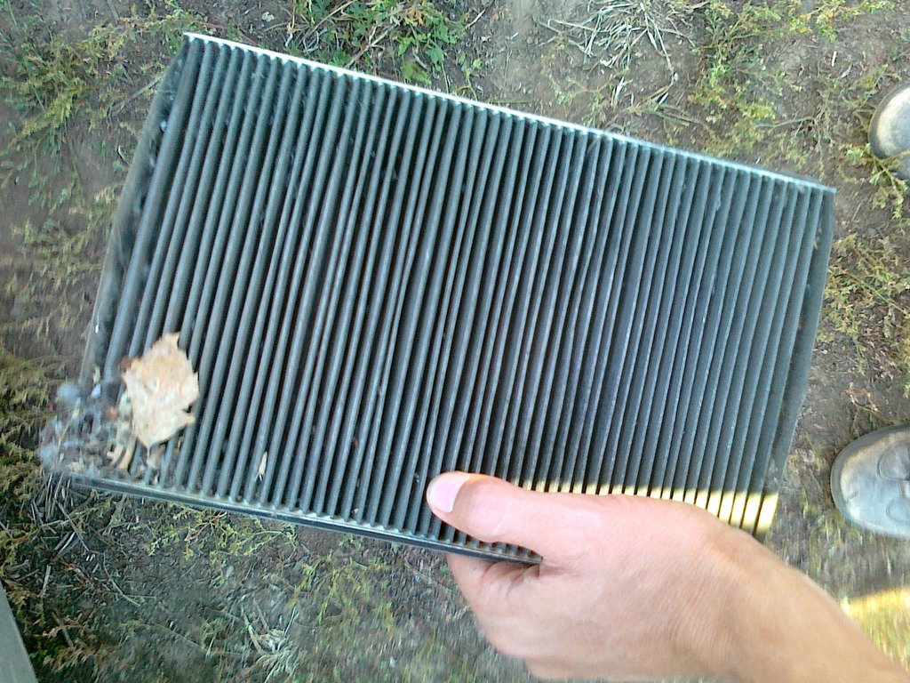

Для замены салонного фильтра понадобятся:

- фильтр
- крестовая отвертка
- фонарик
- тряпка под коленки
- хорошая погода

Операция занимает 15 минут. Перед входом со стороны переднего пассажира лучше бросить тряпку, потому что, чтобы добраться до фильтра, придётся встать на колени и залезть под бардачок.

Фильтр находится под бардачком.

Крепится двумя шурупами.

Следующие две фотографии должны сподвигнуть увидевших их на срочную замену фильтра в своей машине. Я не менял фильтр два года.

Я поставил себе угольный фильтр. Его код: **9.7.541** (260 руб. на экзисте).

Можно не извращаться и поставить обычный — будет дешевле. Код обычного фильтра: **9.7.540** (150 руб. на экзисте).
