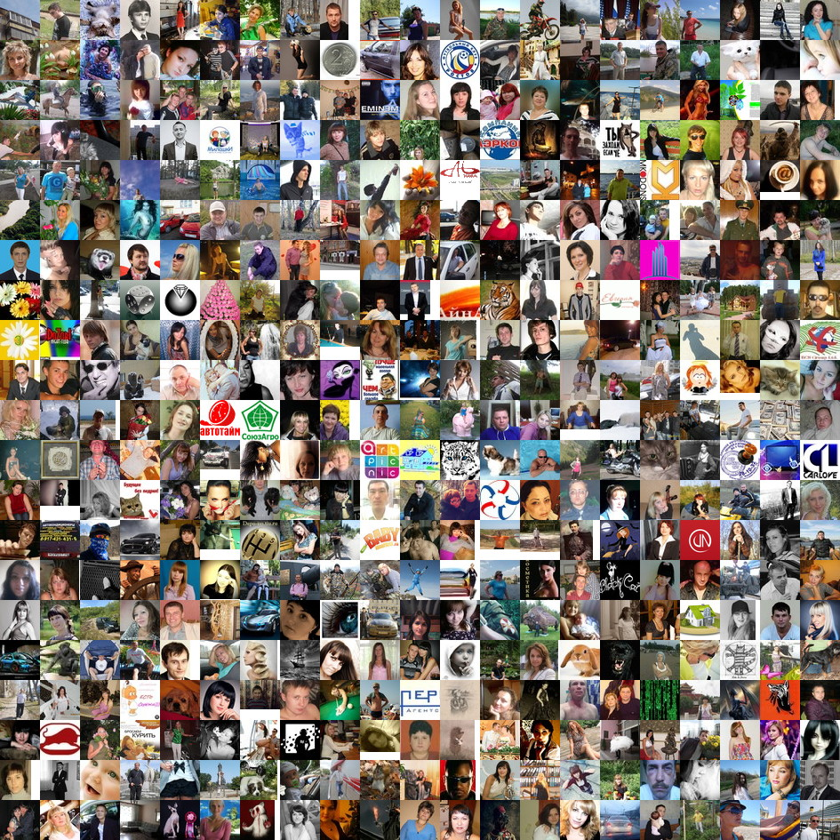

Из фотографий или картинок одинакового размера можно сделать мозаику. Получается интересный эффект.

Для этого я написал два bash-скрипта.

Первый уменьшает размеры фотографий, второй делает из миниатюр мозаику.

### Скрипт для уменьшения фотографий

```bash
#!/bin/bash

SW=150
SH=150
FROMDIR="fromdir"
TODIR="todir"

for name in $(ls $FROMDIR); do
  convert -resize ${SW}x${SH} -strip $FROMDIR/$name $TODIR/$name
done
```

Здесь:

- `SW` — ограничение ширины миниатюры;
- `SH` — ограничение высоты миниатюры;
- `FROMDIR` — каталог, в котором находятся фотографии;
- `TODIR` — каталог, в который будут сложены миниатюры.

---

### Скрипт для создания мозаики из миниатюр

```bash
#!/bin/bash

SW=150
SH=112
COLS=15
REZFILE="mosaic-`date "+%Y-%m-%d_%H_%M_%S"`.jpg"
FDIR="small"

(
echo "convert $(i=0 && for name in $(ls $FDIR | sort -R); do echo -n " -page +$[($i%$COLS)*$SW]+$[(($i-$i%$COLS)/$COLS)*$SH] $FDIR/$name"; i=$[$i+1]; done) -mosaic $REZFILE"
)
```

Здесь:

- `SW` — ширина миниатюры;
- `SH` — высота миниатюры;
- `COLS` — количество столбцов;
- `REZFILE` — имя файла с мозаикой;
- `FDIR` — каталог с миниатюрами.

---

> **Важно:** Все миниатюры должны быть одинакового размера, иначе будут пустоты.

Чтобы мозаика повторяла пропорции исходных фотографий, должно быть:

**SW == SH**

Число фотографий должно равняться произведению:

**SW * SH**

В последнем скрипте используется `sort -R` для случайного упорядочивания. Если его убрать, будет тот порядок, в котором выдает `ls`.

---

Вот пример мозаики из аватарок пользователей сайта:



