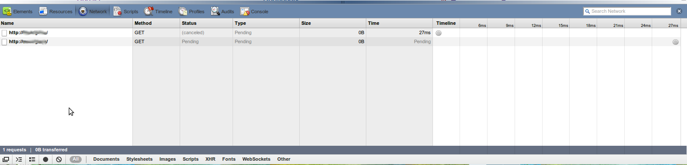
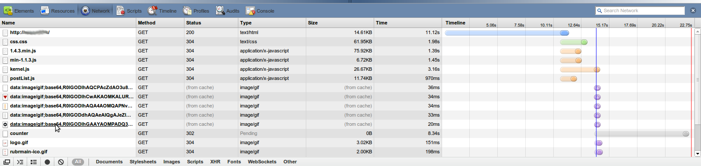

Еще раз к вопросу [откуда в логах берутся строки вида](http://www.valmat.ru/2013/01/ban-bot-2.html):

```
1.1.1.1 - - [19/Jan/2013:07:19:23 +0400] "-" 400 0 "-" "-"
```

При медленном соединении удалось отловить эффект появления таких записей в браузере и увидеть все вживую.

Вот тут видно, как Chrome отправил два запроса, держит соединение открытым, а потом закрывает:



А секундой позже уже загружает то, что его просили.



Успел сделать снимки экрана.

Повторить эксперимент можно либо подключившись к медленному каналу, либо намеренно ограничив скорость соединения на стороне веб-сервера.

