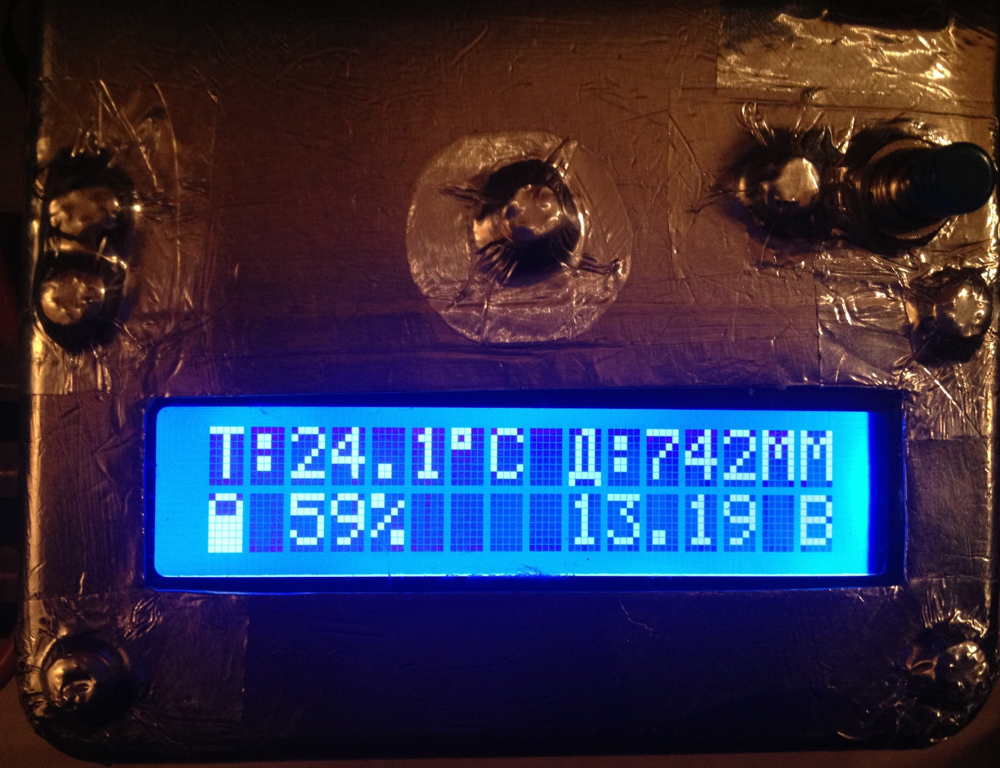
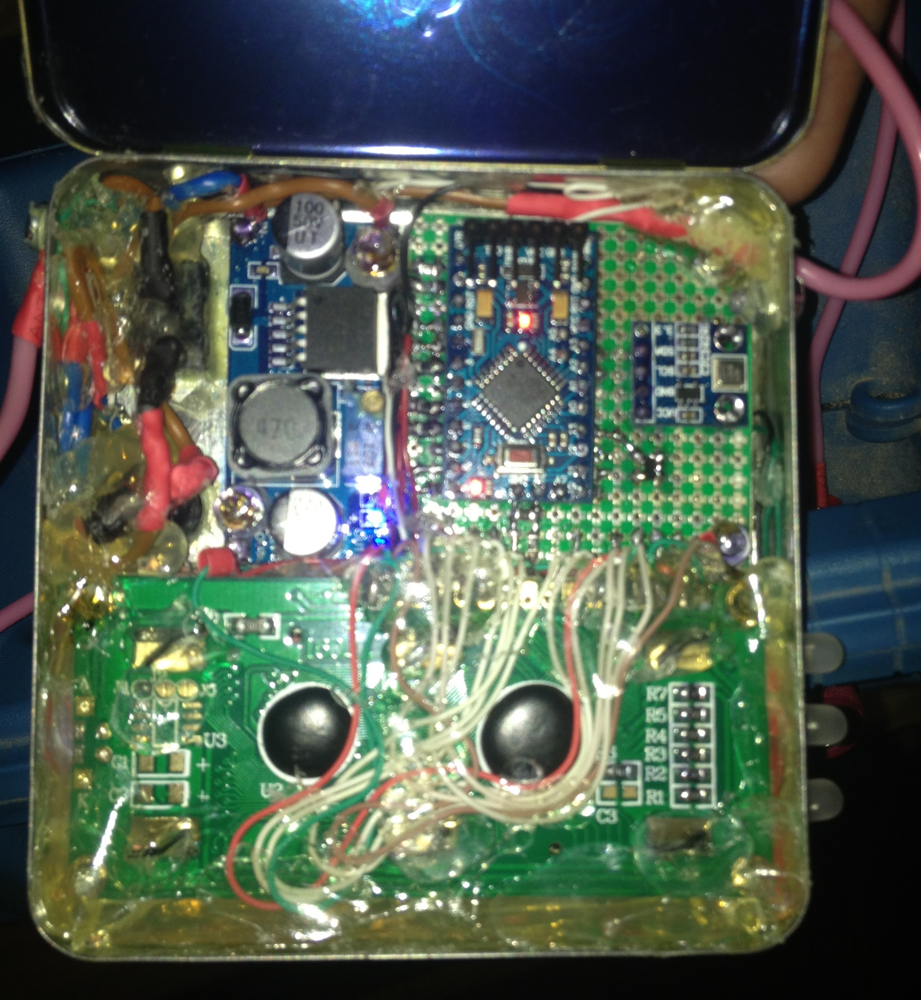
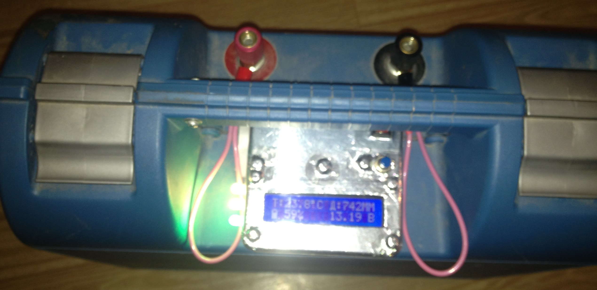
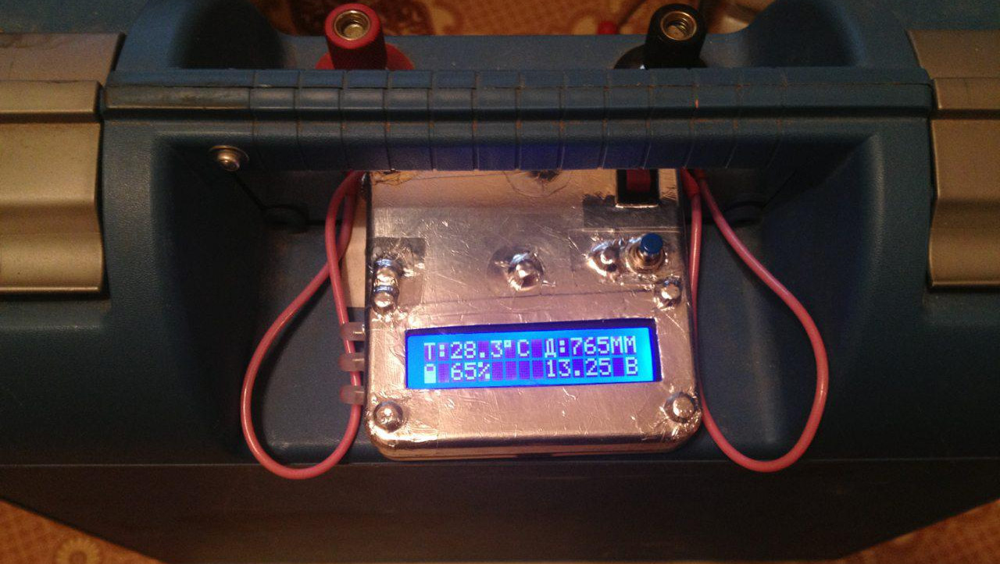

Пару лет назад подарили отцу на день рождения лодочный электромотор и литиевый тяговый аккумулятор к нему. Хорошая вещь, сплошные положительные эмоции от использования. Но, как оказалось, мотор не рассчитан на работу с этим аккумулятором. В том смысле, что индикация уровня заряда на корпусе мотора оказалась совершенно неадекватной.

Решил попробовать сделать необходимый девайс на Arduino.

До этого с микроконтроллерами дела не имел. Оказалось, это совсем не сложно и даже интересно.

Исходники выложил на GitHub: [https://github.com/valmat/BatterySensor](https://github.com/valmat/BatterySensor)

Документация там же.

Прибор умеет отображать уровень заряда батареи в процентах, с помощью значка, а также тремя RGB светодиодами, которые постепенно меняют свои цвета с зелёного на жёлтый, потом на красный — в зависимости от уровня заряда.

На корпусе расположил выключатель и кнопку. Кнопка выключает светодиоды, а долгое нажатие кнопки отключает подсветку экрана. Для экономии батареи в солнечный день и чтобы не слепило ночью.

Кроме того, подключил датчик BMP180. Устройство показывает температуру и давление. Давление на рыбалке знать необходимо.

Корпус сделал герметичным. Всё проклеил резиновым клеем, а сверху заклеил алюминиевым скотчем.

Работает надёжно. Показания точные.

