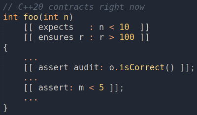

# Пробуем контрактное программирование С++20 уже сейчас



В С++20 появилось контрактное программирование. На текущий момент ни один компилятор ещё не реализовал поддержку этой возможности.

Но есть способ уже сейчас попробовать использовать контракты из C++20, так как это описано в стандарте.
<cut text="Заинтересовавшихся прошу под кат" />

### TL;DR
*Есть форк clang, поддерживающий контракты. На его примере я рассказываю как пользоваться контрактами, чтобы как только фича появилась в вашем любимом компиляторе, вы сразу же могли начать её использовать.*


Про контрактное программирование уже написано много, но в двух словах расскажу что это такое и для чего нужно.

## Логика Хоара
В основе парадигмы контрактов лежит логика Хоара ([1](https://ru.wikipedia.org/wiki/%D0%9B%D0%BE%D0%B3%D0%B8%D0%BA%D0%B0_%D0%A5%D0%BE%D0%B0%D1%80%D0%B0), [2](https://habr.com/ru/post/268013/)).

Логика Хоара – это способ формального доказательства корректности алгоритма.
Она оперирует такими понятиями, как предусловие, постусловие и инвариант.
С практической точки зрения, использование логики  Хоара это, во-первых, способ формального доказательства корректности программы в тех случаях, когда ошибки могут привести к катастрофе или гибели людей. Во-вторых, способ повысить надёжность программы, наряду со статическим анализом и тестированием.

## Контрактное программирование
([1](https://ru.wikipedia.org/wiki/%D0%9A%D0%BE%D0%BD%D1%82%D1%80%D0%B0%D0%BA%D1%82%D0%BD%D0%BE%D0%B5_%D0%BF%D1%80%D0%BE%D0%B3%D1%80%D0%B0%D0%BC%D0%BC%D0%B8%D1%80%D0%BE%D0%B2%D0%B0%D0%BD%D0%B8%D0%B5), [2](https://habr.com/ru/post/38612/))

Основная идея контрактов в том, что по аналогии с контрактами в бизнесе, для каждой функции или метода описываются договорённости. Эти договорённости должны соблюдать как вызывающая сторона, так и вызываемая.
Неотъемлемой частью контрактов является как минимум два режима сборки – отладочный и продуктовый. В зависимости от режима сборки контракты должны себя вести по разному. Наиболее распространённой практикой является проверка контрактов в отладочной сборке и их игнорирование в продуктовой.

Иногда в продуктовой сборке контракты тоже проверяются и их невыполнение может, например, вести к генерации исключения.

Основное отличие использования контрактов от «классического» подхода в том, что вызывающая сторона должна соблюдать предусловия вызываемой стороны, которые описываются в контракте, а вызываемая должна соблюдать свои постусловия и инварианты.
Соответственно, вызываемая сторона не обязана проверять корректность передаваемых её параметров. Эта обязанность возлагается контрактом на вызывающую сторону.

Несоблюдение контрактов должно быть обнаружено на этапе тестирования и дополняет все виды тестов: модульные интеграционные и т. д.

На первый взгляд, использование контрактов ведёт к усложнению разработки и ухудшает читаемость кода. На самом деле, всё как раз наоборот. Приверженцам статической типизации будет проще всего оценить пользу контрактов, потому что простейшим их вариантом является описание типов  в сигнатуре методов и функций.

Итак, какую пользу дают контракты:
*    Улучшают читаемость кода за счёт явного документирования.
*    Повышают надёжность кода, дополняя собой тестирование.
*    Позволяют компиляторам использовать низкоуровневые оптимизации и генерировать более быстрый код в расчёте на соблюдение контракта. В последнем случае несоблюдение контракта в релизной сборке может вести к UB.

## Контрактное программирование в C++
Контрактное программирование реализовано во многих языках. Наиболее яркие примеры, это [Eiffel](https://www.eiffel.org/doc/eiffel/ET-_Design_by_Contract_%28tm%29%2C_Assertions_and_Exceptions), где парадигма была впервые реализована, и [D](https://dlang.org/spec/contracts.html), в D контракты являются частью языка.

В C++, до стандарта C++20, контракты можно было использовать в виде отдельных библиотек.

Такой подход имеет ряд недостатков:
*    Весьма неуклюжий синтаксис с использованием макросов.
*    Отсутствие единого стиля.
*    Невозможность использования контрактов компилятором для оптимизации кода.

В основе библиотечных реализаций обычно лежит использование старого доброго assert'а и препроцессорных директив, проверяющих наличие флага компиляции.

Использование контрактов в таком виде, действительно делает код уродливым и нечитаемым. Это одна из причин, почему использование контрактов в C++ мало практикуется.

Забегая вперёд, покажу как в C++20 будет выглядеть использование контрактов.
А затем, разберём всё это подробнее:

```cpp
int f(int x, int y)
    [[ expects: x > 0 ]]       // precondition
    [[ expects: y > 0 ]]       // precondition
    [[ ensures r: r < x + y ]] // postcondition
{
    int z = (x - x%y) / y;
    [[ assert: z >= 0 ]];      // assertion
    return z + y;
}
```
## Пробуем
К сожалению, на текущий момент ни один из широко используемых компиляторов ещё не реализовал поддержку контрактов.
Но есть выход.

*ARCOS research group* из *Universidad Carlos III de Madrid* реализовали экспериментальную поддержку контрактов в форке clang++.

Чтобы не «писать код на бумажке», а иметь возможность сразу же попробовать новые возможности в деле, мы можем собрать этот форк и с его помощью пробовать приводимые ниже примеры.

Инструкция по сборке описана в readme репозитория на Гитхабе
https://github.com/arcosuc3m/clang-contracts

```bash
git clone https://github.com/arcosuc3m/clang-contracts/
mkdir -p clang-contracts/build/ && cd clang-contracts/build/
cmake -G "Unix Makefiles" -DLLVM_USE_LINKER=gold -DBUILD_SHARED_LIBS=ON -DLLVM_USE_SPLIT_DWARF=ON  -DLLVM_OPTIMIZED_TABLEGEN=ON ../
make -j8
```

У меня не возникло проблем при сборке, но компиляция исходников занимает очень много времени.

Для компиляции примеров вам нужно будет явно указать путь к бинарнику clang++.
Например, у меня это выглядит примерно так

```bash
/home/valmat/work/git/clang-contracts/build/bin/clang++ -std=c++2a -build-level=audit -g test.cpp -o test.bin
```

Я подготовил примеры, чтобы вам было удобно исследовать контракты на примерах реального кода. Предлагаю, прежде чем приступить к чению следующего раздела, склонировать и скомпилировать примеры.

```bash
git clone https://github.com/valmat/cpp20-contracts-examples/
cd cpp20-contracts-examples
make CPP=/path/to/clang++
```
Здесь `/path/to/clang++` путь к бинарнику `clang++` вашей сборки экспериментального компилятора.


Кроме самого компилятора, ARCOS research group подготовили свою версию [Compiler Explorer](http://fragata.arcos.inf.uc3m.es/)  для своего форка.

## Контрактное программирование в C++20
Теперь ничего не мешает нам приступить к исследованию возможностей, которые даёт контрактное программирование, и сразу пробовать эти возможности в деле.

Как уже было сказано выше, контракты строятся из предусловий, постусловий и инвариантов (утверждений).

В C++20 для этого используются атрибуты со следующим синтаксисом

```cpp
[[contract-attribute modifier identifier: conditional-expression]]
```

Где `contract-attribute` может принимать одно из следующих значений:
**expects**, **ensures** или **assert**.


`expects` используется для предусловий, `ensures` для постусловий и `assert` для утверждений.

`conditional-expression` – это булево выражение, проверяемый в контракте предикат.
`modifier` и `identifier` могут быть опущены.

Зачем нужен `modifier` я напишу чуть ниже.

`identifier` используется только с `ensures` и служит для представления возвращаемого значения.


Предусловия имеют доступ к аргументам.

Постусловия имеют доступ к возвращаемому функцией значению. Для этого используется синтаксис

```cpp
[[ensures return_variable: expr(return_variable)]]
```
Где `return_variable` любое валидное выражение для переменной.

Другими словами, предусловия предназначены, чтобы объявлять ограничения, накладываемые на принимаемые функцией аргументы, а постусловия для того, чтобы объявлять ограничения, накладываемые на возвращаемое функцией значение.

Считается, что *предусловия* и *постусловия* являются частью интерфейса функции, в то время как *утверждения* являются частью её реализации.

Предикаты предусловий всегда вычисляются непосредственно перед выполнением функции. Постусловия выполняются сразу же после передачи функцией управления вызывающему коду.

Если в функции происходит выброс исключения, то постусловия не будет проверяться.
Постусловия проверяются только в случае нормального завершения функции.

Если при проверке выражения в контракте возникло ислючение, то будет вызван `std::terminate()`.


Предусловия и постусловия всегда описываются вне тела функции и не могут иметь доступ к локальным переменным.

Если предусловия и постусловия описывают контракт для публичного метода класса, они не могут иметь доступ к приватным и защищённым полям класса. Если метод класса защищённый, то к защищённым и публичным данным класса доступ есть, а к приватным нет.
Последнее ограничение совершенно логично, если учесть, что контракт является частью интерфейса метода.

Утверждения (инварианты) всегда описываются в теле функции или метода. По дизайну они являются частью реализации. И, соответственно, могут иметь доступ ко всем доступным данным. В том числе, к локальным переменным функции и приватным и защищённым полям класса.


[пример 1](https://github.com/valmat/cpp20-contracts-examples/blob/master/example1.cpp)

Определим два предусловия, одно постусловие и один инвариант:
```cpp
int foo(int x, int y)
    [[ expects: x > y ]]   // precondition  #1
    [[ expects: y > 0 ]]   // precondition  #2
    [[ ensures r: r < x ]] // postcondition #3
{
    int z = (x - x%y) / y;
    [[ assert: z >= 0 ]];  // assertion
    return z;
}

int main()
{
    std::cout << foo(117, 20) << std::endl;
    std::cout << foo(10,  20) << std::endl; // <-- contract violation #1
    std::cout << foo(100, -5) << std::endl; // <-- contract violation #2

    return 0;
}
```

[пример 2](https://github.com/valmat/cpp20-contracts-examples/blob/master/example2.cpp)

Предусловие публичного метода не может ссылаться на защищённое или приватное поле:
```cpp
struct X
{
//protected:
    int m = 5;
public:
    int foo(int n)
        [[expects: n < m]]
    {
        return n*n;
    }
};
```

Не допускается модификация переменных внутри выражений, описываемых атрибутами контракта. Если это нарушено, будет UB.

Выражения, описываемые в контрактах, не должны иметь побочных эффектов. Хотя компиляторы могот это проверять, такая обязанность на них не возлагается. Нарушение этого требования считается неопределённым поведением.

```cpp
struct X
{
    int m = 5;
    int foo(int n)
        [[ expects: n < m++ ]]  // UB: Modifies variable m
    {
        int k = n*n;
        [[ assert: ++k < 100 ]] // UB: Modifies variable k
        return n*n;
    }
};
```
Требование не изменять состояние программы в выражениях контрактов станет очевидно чуть ниже, когда я расскажу про уровни модификаторов контрактов и режимы сборки.

Сейчас просто отмечу, что корректная программа должна работать так же, как если бы контрактов вообще не было.

Как я отмечал выше, в контракте можно указывать сколько угодно предусловий и постусловий.
Все они будут проверены по порядку. Но  предусловия всегда проверяются до выполнения функции, а постусловия сразу после выхода из неё.

Это означает, что в первую очередь всегда проверяются предусловия, как проиллюстрировано в следующем примере:

```cpp
int foo(int n)
    [[ expects:   expr(n) ]] // # 1
    [[ ensures r: expr(r) ]] // # 4
    [[ expects:   expr(n) ]] // # 2
    [[ expects:   expr(n) ]] // # 3
    [[ ensures r: expr(r) ]] // # 5
{...}
```

Выражения в постусловиях могут ссылаться не только на возвращаемое функцией значение, но и на аргументы функции.

```cpp
int foo(int &n) [[ ensures: expr(r) ]];
```
В этом случае можно опустить идентификатор возвращаемого значения.


Если постусловие ссылается на аргумент функции, то этот аргумент рассматривается *в точке выхода из функции*, а не в точке входа, как в случае с предусловиями.

Нет никакого способа ссылаться на оригинальное (в точке входа в функцию) значение в постусловии.


[пример](https://github.com/valmat/cpp20-contracts-examples/blob/master/example3.cpp):
```cpp
void incr(int &n)
    [[ expects: 3 == n ]]
    [[ ensures: 4 == n ]]
{++n;}
```


Предикаты в контрактах могут ссылаться на локальные переменные, только если время жизни этих переменных соответствует времени вычисления предиката.

Например, для `constexpr` функции нельзя ссылаться на локальные переменные, если только они не известны во время компиляции.

[пример](https://github.com/valmat/cpp20-contracts-examples/blob/master/example4.cpp):

```cpp
int a = 1;
constexpr int b = 100;

constexpr int foo(int n)
  [[ expects: a <= n ]] // error: `a` is not constexpr
  [[ expects: n <  b ]] // OK
{
  [[assert: n > 2*a]];  // error: `a` is not constexpr
  [[assert: n < 2*b]];  // OK
  return 2*n;
}
```

### Контракты для указателей на функцию

Нельзя определить контракты для указателя на функцию, но указателю на функцию можно присвоить адрес функции, для которой определён контракт.

[пример](https://github.com/valmat/cpp20-contracts-examples/blob/master/example5.cpp):
```cpp
int foo(int n)
    [[expects: n < 10]]
{
    return n*n;
}

int (*pfoo)(int n) = &foo;
```

Вызов `pfoo(100)` приведёт к нарушению контракта.


### Контракты при наследовании

Классическая реализация концепции контрактов предполагает, что предусловия могут быть ослаблены в подклассах, постусловия и инварианты могут быть усилены в подклассах.

В реализации C++20 это не так.

Во-первых, инварианты в C++20 являются частью реализации, а не интерфейса. По этой причине, их можно как усилить, так и ослабить. Если в реализации виртуальной функции `assert` отсутствует, то он не будет унаследован.

Во-вторых, требуется, чтобы при наследовании функции были [ODR](https://ru.wikipedia.org/wiki/%D0%9F%D1%80%D0%B0%D0%B2%D0%B8%D0%BB%D0%BE_%D0%BE%D0%B4%D0%BD%D0%BE%D0%B3%D0%BE_%D0%BE%D0%BF%D1%80%D0%B5%D0%B4%D0%B5%D0%BB%D0%B5%D0%BD%D0%B8%D1%8F) идентичны.
А, поскольку предусловия и постусловия являются частью интерфейса, то в наследнике они должны в точности совпадать.

При этом, описание предусловий и постусловий при наследовании можно опустить. Но если они объявлены, то должны в точности совпадать с определением в базовом классе.

[пример](https://github.com/valmat/cpp20-contracts-examples/blob/master/example6-inheritance.cpp):
```cpp
struct Base
{
    virtual int foo(int n)
        [[ expects:   n < 10  ]]
        [[ ensures r: r > 100 ]]
    {
        return n*n;
    }
};

struct Derived1 : Base
{
    virtual int foo(int n) override
        [[ expects:   n < 10  ]]
        [[ ensures r: r > 100 ]]
    {
        return n*n*2;
    }
};

struct Derived2 : Base
{
    // Inherits contracts from Base
    virtual int foo(int n) override
    {
        return n*3;
    }
};
```

`<spoiler title="Замечание">`

К сожалению, пример выше [не работает](https://github.com/arcosuc3m/clang-contracts/issues/18) в экспериментальном компиляторе как ожидается.

Если у `foo` из  `Derived2` опустить контракт, то он не будет унаследован из базового класса. Кроме того, компилятор позволяет определить для подкласса контракт несовпадающий с контрактом базового.


Ещё одна [ошибка](https://github.com/arcosuc3m/clang-contracts/issues/20) экспериментального компилятора: синтаксически правильной должна быть запись

```cpp
virtual int foo(int n) override
    [[expects: n < 10]]
{...}
```

Однако в таком виде я получил ошибку компиляции
```bash
inheritance1.cpp:20:36: error: expected ';' at end of declaration list
    virtual int foo(int n) override
                                   ^
                                   ;
```

 и пришлось заменить на
```cpp
virtual int foo(int n)
    [[expects: n < 10]]
override
{...}
```

Думаю, это связано с особенностью экспериментального компилятора, и в релизных версиях компиляторов будет работать синтаксически верный код.

`</spoiler>`


### Модификаторы контрактов


Проверки предикатов контрактов могут нести дополнительные вычислительные расходы.
Поэтому распространённой практикой является проверка контрактов в девелоперской и тестовой сборках и их игнорирование в релизной сборке.

Для этх целей стандарт предлагает три уровня модификаторов контрактов. С помощью модификаторов и ключей компилятора программист может управлять тем, какие контакты будут проверяться в сборке, а какие игнорироваться.

*   `default` – этот модификатор используется по умолчанию. Предполагается, что  вычислительная стоимость проверки выполнения выражения с этим модификатором *небольшая*, по сравнению со стоимостью вычисления самой функции.
*   `audit`  – этот модификатор предполагает, что  вычислительная стоимость проверки выполнения выражения *значительна* по сравнению со стоимостью вычисления самой функции.
*   `axiom`  – этот модификатор используется, если выражение носит декларативный характер. Не проверяется во время выполнения. Служит для документирования интерфейса функции, использования статическими анализаторами и оптимизатором компилятора. Выражения с модификатором `axiom` никогда не вычисляются во время выполнения.

Пример
```cpp
[[expects: expr]]         // Неявно default
[[expects default: expr]] // Явно default
[[expects axiom  : expr]] // Run-time проверки не выполняются
[[expects audit  : expr]] // Вычислительно дорогая проверка
```
Используя модификаторы, можно определить какие проверки в каких версиях ваших сборок будут использоваться, а какие будут отключены.

Стоит отметить, что если даже проверка не выполняется, компилятор вправе использовать контракт для низкоуровневых оптимизаций. И хотя проверка контракта может быть отключена флагом компиляции, нарушение контракта ведёт к неопределённому поведению программы.


На усмотрение компилятора, могут быть предоставлены средства для включения проверок выражений, помеченных как  `axiom`.

В нашем случае, это опция компилятора
```
-axiom-mode=<mode>
```
`-axiom-mode=on` *включает* режим аксиом и, соответственно, *выключает* проверку утверждений с идентификатором `axiom`,

`-axiom-mode=off` *выключает* режим аксиом и, соответственно, *включает* проверку утверждений с идентификатором `axiom`.

[пример](https://github.com/valmat/cpp20-contracts-examples/blob/master/example7-axiom.cpp):

```cpp
int foo(int n)
    [[expects axiom: n < 10]]
{
    return n*n;
}

```

Программа может быть скомпилирована с тремя разными уровнями проверки:

* `off` выключает все проверки выражений в контрактах
* `default` проверяются только выражения с модификатором `default`
* `audit` расширенный режим, когда выполняются все проверки с модификатором `default` и `audit`


Как именно реализовывать установку уровня проверки отводится на усмотрение разработчиков компилятора.

В нашем случае, для этого используется опция компилятора

```bash
-build-level=<off|default|audit>
```

По умолчанию используется `-build-level=default`

Как уже было сказано, компилятор может использовать контракты для низкоуровневых оптимизаций. По этой причине, не смотря на то, что во время выполнения некоторые предикаты в контрактах (в зависимости от уровня проверки) могут не вычисляться, их невыполнение ведёт к неопределённому поведению.

Примеры применения уровней сборки отложу до следующего раздела, там их можно будет сделать наглядными.

### Перехват нарушения контракта

В зависимости от того, с какими опциями собирается программа, в случае нарушения контракта могут быть разные сценарии поведения.

По умолчанию нарушение контракта ведёт к падению программы, вызову `std::termenate()`. Но программист может переопределить это поведение, предоставив свой обработчик и указав компилятору на необходимость продолжать работу программы после нарушения контракта.


При компиляции можно установить обработчик *violation handler*, вызываемый при нарушении контракта.

Способ реализация установки обработчика отводится на усмотрение создателей компилятора.

В нашем случае это
```bash
-contract-violation-handler=<violation_handler>
```

Сигнатура обработчика должна иметь вид
```cpp
void(const std::contract_violation& info)
```

или
```cpp
void(const std::contract_violation& info) noexcept
```

`std::contract_violation` эквивалентна следующему определению:

```cpp
struct contract_violation
{
    uint_least32_t   line_number()     const noexcept;
    std::string_view file_name()       const noexcept;
    std::string_view function_name()   const noexcept;
    std::string_view comment()         const noexcept;
    std::string_view assertion_level() const noexcept;
};
```

Таким образом, обработчик позволяет получить достаточно исчерпывающую информацию о том, где именно и при каких условиях произошло нарушение контракта.


Если обработчик *violation handler* задан, то, в случае нарушения контракта, по умолчанию, сразу после его выполнения будет вызван `std::abort()` (Без указания обработчика вызывается `std::terminate()`).


Стандарт предполагает, что компиляторы предоставляют средства, позволяющие программистам продолжить выполнение программы после нарушения контракта.

Способ реализации этих средств остаётся на усмотрение разработчиков компилятора.
В нашем случае, это опция компилятора

```bash
-fcontinue-after-violation
```

Опции `-fcontinue-after-violation` и `-contract-violation-handler` могут быть установлены независимо друг от друга. Например, можно установить `-fcontinue-after-violation`, но не устанавливать `-contract-violation-handler`. В последнем случае, после нарушения контракта программа просто продолжит работу.


Возможность продолжения работы программы после нарушения контракта специфицирована стандартом, но нужно подходить с осторожностью к этой возможности.

Технически, поведение программы после нарушения контракта не определено, даже если программист явно указал, что программа должна продолжать работать. 

Это связано с возможностью компилятора выполнять низкоуровневые оптимизации в рассчёте на выполнение конрактов.

В идеале, если произошло нарушение конракта, нужно как можно скорее записать диагностическую информацию и завершить работу программы. Нужно точно понимать, что вы делаете позволяя программе работать после violation.


Определим [свой обработчик](https://github.com/valmat/cpp20-contracts-examples/blob/master/violation_handler.h) и с его помощью перехватим нарушение конракта


```cpp
void violation_handler(const std::contract_violation& info)
{
    std::cerr << "line_number     : " << info.line_number()     << std::endl;
    std::cerr << "file_name       : " << info.file_name()       << std::endl;
    std::cerr << "function_name   : " << info.function_name()   << std::endl;
    std::cerr << "comment         : " << info.comment()         << std::endl;
    std::cerr << "assertion_level : " << info.assertion_level() << std::endl;
}
```
И рассмотрим [пример](https://github.com/valmat/cpp20-contracts-examples/blob/master/example8-handling.cpp) нарушения конракта:

```cpp
#include "violation_handler.h"

int foo(int n)
    [[expects: n < 10]]
{
    return n*n;
}

int main()
{
    foo(100); // <-- contract violation
    return 0;
}
```
Скомпилируем программу с опциями `-contract-violation-handler=violation_handler` и `-fcontinue-after-violation` и запустим

```bash
$ bin/example8-handling.bin
line_number     : 4
file_name       : example8-handling.cpp
function_name   : foo
comment         : n < 10
assertion_level : default
```

Теперь можно привести примеры, демонстрирующие поведение программы при нарушении контракта при разных уровнях сборки и режимах контрактов.

Рассмотрим следующий [пример](https://github.com/valmat/cpp20-contracts-examples/blob/master/example9.cpp):

```cpp
#include "violation_handler.h"

int foo(int n)
    [[ expects axiom   : n < 100 ]]
    [[ expects default : n < 200 ]]
    [[ expects audit   : n < 300 ]]
{
    return 2 * n;
}

int main()
{
    foo(350); // audit
    foo(250); // default

    return 0;
}
```
Если собрать его с опцией `-build-level=off` то как и ожидается, конракты не будут проверяться.


Собрав с уровнем `default` (с опцией `-build-level=default`), получим следующий вывод:

```bash
$ bin/example9-default.bin
line_number     : 5
file_name       : example9.cpp
function_name   : foo
comment         : n < 200
assertion_level : default

line_number     : 5
file_name       : example9.cpp
function_name   : foo
comment         : n < 200
assertion_level : default
```

И сборка с уровнем `audit` даст:
```bash
 $ bin/example9-audit.bin
line_number     : 5
file_name       : example9.cpp
function_name   : foo
comment         : n < 200
assertion_level : default

line_number     : 6
file_name       : example9.cpp
function_name   : foo
comment         : n < 300
assertion_level : audit

line_number     : 5
file_name       : example9.cpp
function_name   : foo
comment         : n < 200
assertion_level : default
```

#### Замечания

`violation_handler` может бросать исключения. В этом случае можно настроить программу так, чтобы нарушение контракта вело к выбросу исключения.

Если функция, у которой описаны контракты, помечена как `noexcept` и при проверке контракта вызван `violation_handler`, который бросает исключение, то будет вызван `std::terminate()`.

[Пример](https://github.com/valmat/cpp20-contracts-examples/blob/master/example11.cpp)
```cpp
void violation_handler(const std::contract_violation&)
{
    throw std::exception();
}

int foo(int n) noexcept
    [[ expects: n  > 0 ]]
{
    return n*n;
}

int main()
{
    foo(0); // <-- std::terminate() when violation handler throws an exception
    return 0;
}
```


Если компилятору передан флаг: не продолжать выполнение программы после нарушения контракта (`continuation mode=off`), но обработчик violation handler бросает исключение, то будет принудительно вызвана `std::terminate()`.


### Заключение
Контракты относятся к неинтрузивным проверкам времени выполнения. Они играют очень важную роль в обеспечении качества выпускаемого программного обеспечения.

C++ используется очень широко. И наверняка найдётся достаточное количество притензий к спецификации контрактов. На мой субъективный взгляд, реализация получилась довольно удобной и наглядной.

Контракты C++20 позволят сделать наши программы ещё более надёжными, быстрыми и понятными. С нетерпением жду их реализацию в компиляторах.

### Ссылки
- [Gist](https://gist.github.com/valmat/91b5a7eae275b9ed9e6824d975da151f)
- [Habr](https://habr.com/ru/articles/443766/)
