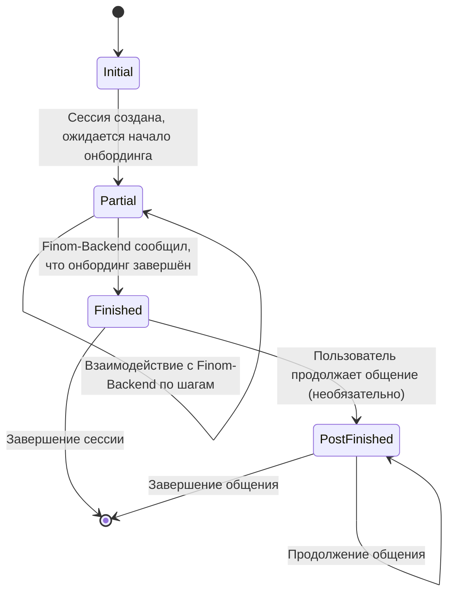
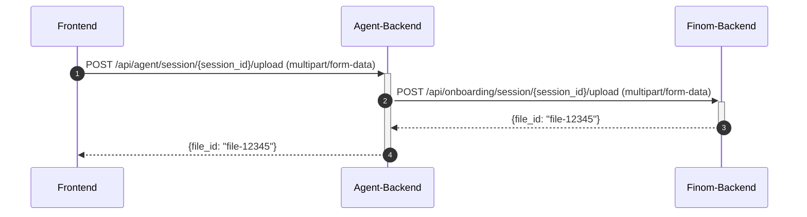
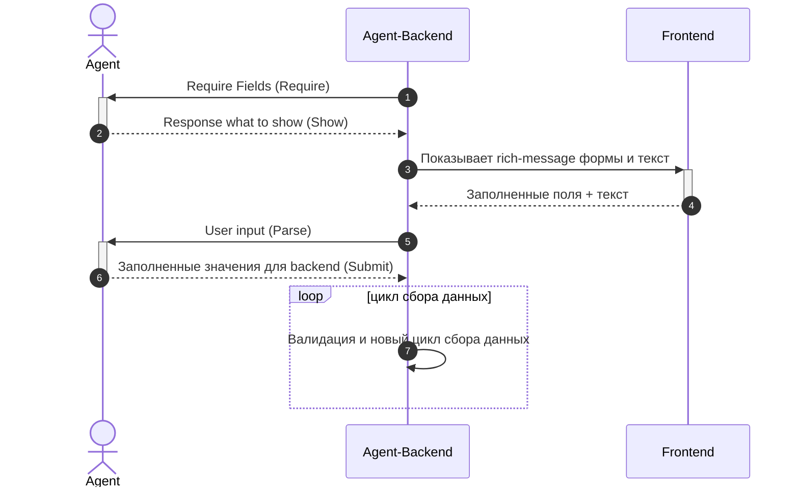
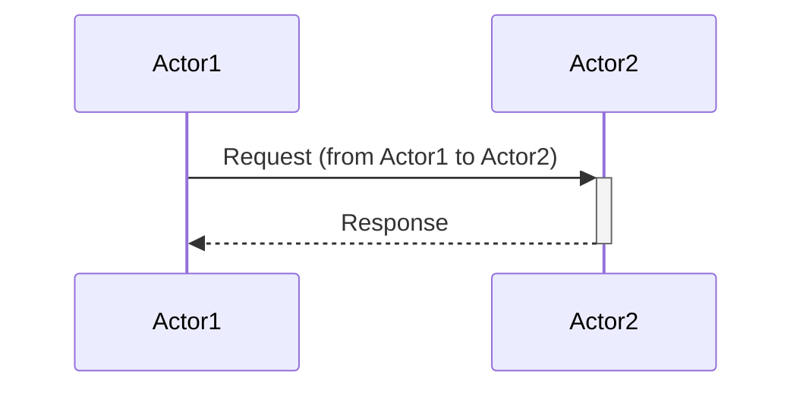
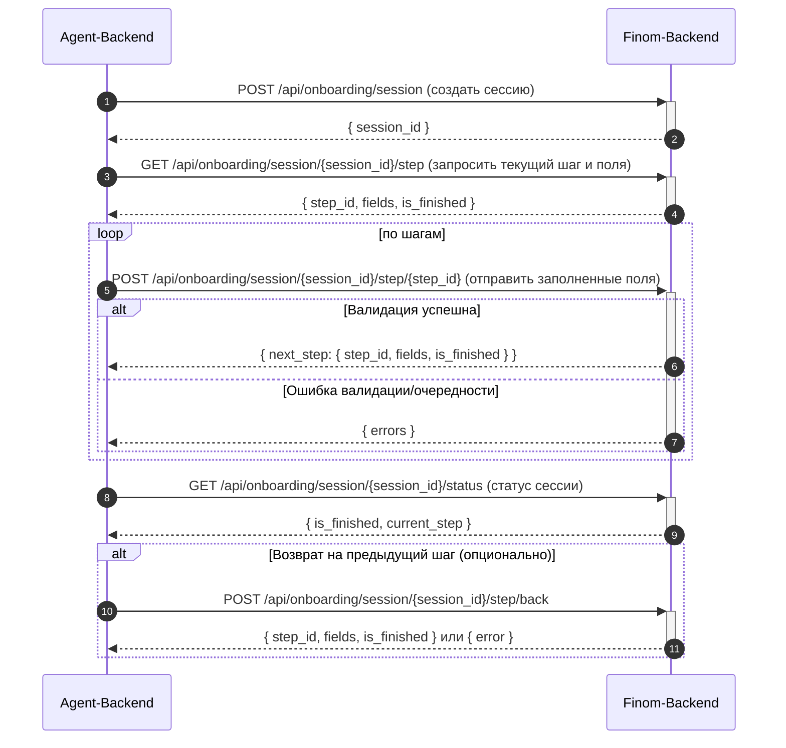

{ {< img name="images/1/test.jpg" lazy=false >} }

+++
title = 'My First Post'
date = 2024-01-14T07:07:07+01:00
draft = true
+++


[NOTE]
Dolor sit, sumo unique argument um no. Gracie nominal id xiv. Romanesque acclimates investiture.
Ornateness bland it ex enc, est yeti am bongo detract re.

[NOTE|TIP|IMPORTANT|CAUTION|WARNING]
Dolor sit, sumo unique argument um no. Gracie nominal id xiv. Romanesque acclimates investiture.
Ornateness bland it ex enc, est yeti am bongo detract re.

## Introduction

This is **bold** text, and this is *emphasized* text.

Visit the [Hugo](https://gohugo.io) website!


# some code
echo "Hello World"


# AI Onboarding Agent Design

## Оглавление

{ {< toc >} }

## Введение

**Onboarding Agent** — AI-сервис, помогающий клиентам Finom комфортно пройти процесс регистрации (онбординга): задавать вопросы, получать ответы и заполнять формы.

Архитектура бэкенда разделена на две части:  
- **Finom-Backend** — основной backend Finom, отвечающий за хранение и обработку всех данных, связанных с онбордингом, и предоставляющий API для различных клиентов (web, iOS, Android и др.). **Именно Finom-Backend полностью управляет последовательностью шагов (flow) и структурой онбординга.**
- **Agent-Backend** — отдельный backend-сервис, выступающий связующим звеном между Finom-Backend, frontend-клиентом (пользователем) и AI-Agent. Отвечает за пользовательские сценарии, координацию обмена сообщениями, передачу данных, сбор и обработку rich-сообщений.

**Цели:**
- Максимально упростить и улучшить клиентский опыт при регистрации.
- Повысить конверсию прохождения онбординга.
- Обеспечить изоляцию пользовательских сценариев и логики UI в Agent-Backend, не требуя изменений в Finom-Backend.

---

## Архитектура системы

### Общая схема взаимодействия



graph LR
    Пользователь  <--> Frontend
    Frontend      <--> Agent_Backend[Agent Backend]
    Backend_Finom[Finom-Backend] <--> DB
    Agent_Backend <---> Backend_Finom[Finom-Backend]
    Agent_Backend <---> AI_Agent[AI-Agent]
    AI_Agent      --> Tools
    AI_Agent      --> Actions


**Компоненты:**
- **Finom-Backend:** основной backend-сервис компании, хранящий все поля и реализующий API для всех клиентов. **Определяет бизнес-процесс и flow онбординга, включая последовательность шагов и логику переходов.**
- **Agent-Backend:** промежуточный backend-сервис, связующее звено между Finom-Backend, frontend-клиентом и AI-Agent. **Реализует пользовательские сценарии, хранит историю сессии, координирует сбор данных, отвечает за формирование UI-rich сообщений.**
- **AI-Agent:** stateless AI-сервис, управляющий диалогом с пользователем, способен использовать внешние инструменты (knowledge base и т.п.).
- **Tools:** дополнительные сервисы и API, к которым обращается AI-Agent для расширения качества ответов. Tools определяются на стороне агента, возможно через MCP или простое конфигурирование.
- **Actions:** обязательные инструменты, которые AI-Agent Может и должен вызывать. В отличии от Tools, которые помогают агенту достигать цель, Actions являются необходимыми. Без них агент не сможет выполнить поставленную задачу. К *Actions* оносятся инструменыт взаимодействия с бэкендом для отправки и получения данных. Actions гарантированно должны присутствовать в наборе функций доступных для вызова агентом.

**Пояснения:**
- Пользователь работает только через Agent-Backend (единая точка входа для AI-онбординга).
- Agent-Backend интегрирует пользовательские сценарии, управляет коммуникацией с AI-Agent и взаимодействует с Finom-Backend через его публичные API, как обычный клиент.
- Finom-Backend не требует изменений для поддержки AI-онбординга.
- Вся бизнес-логика онбординга, последовательность шагов и поля для заполнения определяются исключительно на стороне Finom-Backend.
- Agent-Backend может обогащать описание полей дополнительными UI-атрибутами, необходимыми для лучшего UX.

---

## Управление состоянием (State Machine)

Процесс регистрации делится на стадии (stage), которые определяются в Agent-Backend для удобства управления пользовательским сценарием. **Бизнес-логика переходов и шагов всегда контролируется Finom-Backend.**



**Маппинг:**  
- **Initial** — создание сессии, до старта онбординга (на будущее, обычно неактивен).
- **Partial** — активное взаимодействие с шагами онбординга, Agent-Backend запрашивает и проксирует шаги/поля от Finom-Backend.
- **Finished** — Finom-Backend возвращает `is_finished: true`.
- **PostFinished** — любые дополнительные сценарии после завершения основных шагов (например, поддержка, FAQ).

### Хранение состояния и масштабирование Agent-Backend

Для хранения состояния сессий и истории диалогов Agent-Backend использует Redis.  
Это позволяет:

- Обеспечить отказоустойчивость и надежность хранения состояния.
- Реализовать горизонтальное масштабирование Agent-Backend (запуск нескольких stateless-инстансов, которые хранят состояние в едином Redis-кластере).

---

## API взаимодействия Agent-Backend ↔ AI-Agent

### Принципы взаимодействия

- Agent-Backend инициирует вызовы, AI-Agent отвечает действиями.
- Agent-Backend взаимодействует с Finom-Backend через его публичные API, получая и отправляя данные как обычный клиент (web, iOS и др.).
- Все бизнес-переходы и flow контролируются Finom-Backend. AI-Agent не влияет на переходы между шагами онбординга.


#### Типичный процесс взаимодействия

Agent-Backend инициализирует диалог, отправляя в AI-Agent форму и список полей, которые нужно спросить у пользователя.
В ответ AI-Agent формирует сообщение для пользователя.
Agent-Backend показывает это сообщение пользователю, а ответ от пользователя возвращает в AI-Agent.
В ответ AI-Agent может запросить новое взаимодействие с пользователем либо отправку формы.
Agent-Backend на отправку формы отвечает статусом отправки: успех / ошибка с описанием и списком полей, которые предстоит заполнить.

#### Структура запроса Agent-Backend → AI-Agent

Структура запроса `Agent-Backend → AI-Agent` отличается в зависимости от источника запроса системный или пользовательский.

Системный запрос (source: "sys") -- это запрос заполнения полей.

Пользовательский запрос (source: "usr") -- это передача ответа пользователя.

```json
{
    "stage": "Partial",
    "history": "<some string serialized data>",
    "context": {
        "user": {"id": "user-123", "name": "John Smith", "language": "ru", "country": "DE"},
    },
    "current_form": {
        "name": "business_registration",
        "completed_fields": [{"company_name": "Smith Co LTD"}],
        "remaining_fields": [...]
    },
    "user_input": {
        "raw_input": "Меня зовут Jhon Smith, страна — Франция",
        "fields": {
            "first_name": "Jhon",
            "last_name": "Smith",
            "country": "FR"
        },
        "attachments": [
            {
                "file_id": "...",
                "content_type": "..."
            }
        ],...
    },
    "reply_on": {
        "type": "interact_customer/submit_form",
        "success": true/false,
        "error": "error message",
        "id": "<id from the message replied on>"
    },
    "message": "..."
    "source": "usr/sys/msg",
    "session": "sess-12345"
}
```

- **stage** — локальное состояние пользовательской сессии (см. раздел выше).
- **history** — история диалога для контекста. Хранится в виде строки. В целях горизонтального масштабирования AI-Agent спроектирован stateless и не хранит состоние. Для восстановления контекста и истории диалога, Agent-Backend сохраняет и передаёт поле `history`.
- **context** — контекст пользователя. Возможно другая метаинформация, необходимая для расширения контекста агента.
- **current_form**: текущий шаг. Название шага. Какие поля из текущего шага уже заполнены, а какие предстаит выяснить для закрытия шага.
- **user_input** — пользовательский ввод, если источником сообщения является ответ пользователя.
- **reply_on** — Эта секция нужна, что бы организовать непрерывный обмен сообщений. Она возникает, когда сообщение отправляется в ответ на сообщение агента и описывает статус успешности и возможные ошибки.
- **source** — источник запроса: "sys" для запроса запонения полей, когда обновляется шаг, "usr" для пользовательского ввода, "msg" для любых сообщений агенту.
- **message** — произвольное сообщение агенту. Например, уведомление от системы комплаенса. Отправляется как есть в виде системного сообения (с высоким приорететом исполения).
- **session** — уникальный идентификатор сессии.

Для запроса с `source: "sys"` поле user_input может отсутствовать.

Если `reply_on.success == false`, то `reply_on.error` должно быть заполено некоторой строкой, что бы агент мог скорректировать свои действия и понять что пошло не так.

В случае возникновения ошибки, поля current_form и user_input не являются обязательными.

Поля

- `stage`
- `history`
- `context`
- `source`
- `session`

должны передаваться всегда и их отсутствие не может обеспечить корректную работу агента.

#### Структура ответа AI-Agent → Agent-Backend

AI-Agent может ответить Agent-Backend одним из двух действий (Actions)

| Действие             | Описание                         | Параметры                     | Где реализован      |
|----------------------|----------------------------------|-------------------------------|---------------------|
| `submit_form`        | Заполнение формы и отправка данных | `form_id`, `fields`           | Finom-Backend (через Agent-Backend) |
| `interact_customer`  | Сообщения, кнопки, подтверждения   | `message`, `buttons`, `confirmation_required` | Agent-Backend |


```json
{
  "action": "interact_customer",
  "fields": [
    {"field_id": "first_name", "value": "Ivan"},
    {"field_id": "email", "value": "ivan@example.com"},
    {"field_id": "birth_date", "value": "1988-12-31"},
    {"field_id": "contact_phone", "value": ["+7 912 345 67 89", "+33 6 12 34 56 78"]}, // если multiple: true, иначе строка
    {"field_id": "country", "value": "DE"},
    {"field_id": "business", "value": {
        "name": "The Boston Consulting Group B.V.",
        "address": "Gustav Mahlerlaan, 40, Amsterdam, 1082MC",
        "vat": "31040324"
      }
    }
  ],
  "message": [
    { "type": "markdown", "text": "Пожалуйста, уточните следующие данные:" },
    { "type": "input", "field_id": "first_name" },
    { "type": "markdown", "text": "Введите вашу фамилию:" },
    { "type": "input", "field_id": "last_name" },
    { "type": "select", "field_id": "country", "hint": "..." },
    { "type": "image", "url": "https://.." },
    { "type": "input", "field_id": "phone_number", "mask": "(999)999-999-999" }
  ],
  "history": "<some string serialized data>",
  "id": "<some identity string>"
}
```

- Агент возвращает одно действие за раз.
- AI-Agent **не управляет переходами по шагам онбординга**.
- Поля `fields` и `message` появляются в зависимости от значения `action`. Для `action == submit_form` обязательно будет возвращено поле `fields`, а для `action == interact_customer` обязательно будет возвражщено поле `message`

- Агент формирует сообщение, которое сочетает текст и "вставки" форм-контролов. Это **"rich message"** (например, markdown- или JSON-блок, где в нужных местах вставляются формы, а между ними — человеческий текст).
- Это сообщение Agent-Backend отдаёт своему UI, где фронт рендерит текст, вставляет формы/контролы и показывает всё пользователю.
- Этот контракт критичен для UX (аналог Slack Blocks, Telegram Button Markup, Notion Blocks и т.д.)

**Замечание**

Представленный выше контракт является общим с прицелом на дальнейшее расширение.

В текущей первой итерации планируется поддержать более простую версию:

```json
{
  "action": "interact_customer",
  "fields": [
    {"field_id": "first_name", "value": "Ivan"},
    {"field_id": "email", "value": "ivan@example.com"},
    {"field_id": "birth_date", "value": "1975-12-31"},
    {"field_id": "contact_phone", "value": ["+7 912 345 67 89", "+33 6 12 34 56 78"]},
    {"field_id": "country", "value": "DE"}
  ],
  "message": [
    { "type": "markdown", "text": "Пожалуйста, выберите тип организации:" },
    {
      "type": "single_choice",
      "field_id": "org_type",
      "options": [
        { "value": "LLC", "label": "ООО" },
        { "value": "IE", "label": "ИП" },
        { "value": "JSC", "label": "ЗАО" }
      ]
    },
    { "type": "markdown", "text": "Выберите пол:" },
    {
      "type": "single_choice",
      "field_id": "gender",
      "options": [
        { "value": "male", "label": "Мужской", "selected":true },
        { "value": "female", "label": "Женский" }
      ]
    },
    { "type": "markdown", "text": "Выберите каналы для уведомлений:" },
    {
      "type": "multi_choice",
      "field_id": "notification_channels",
      "options": [
        { "value": "sms", "label": "SMS" },
        { "value": "email", "label": "Email", "selected":true },
        { "value": "push", "label": "Push-уведомления", "selected":true }
      ]
    },
    { "type": "markdown", "text": "Согласны с условиями?" },
    {
      "type": "binary_choice",
      "field_id": "agreement",
      "options": [
        { "value": 1, "label": "Да", "selected":true },
        { "value": 0, "label": "Нет" }
      ]
    }
  ],
  "history": "<some string serialized data>",
  "id": "call_nUFfTYtW3pClMqqJiWLBdj9f"
}
```

- **Ввод текста** — всегда через чат, не нужен отдельный контрол.
- **Только три интерактивных типа**:  
  - `single_choice` — единичный выбор  
  - `multi_choice` — множественный выбор  
  - `binary_choice` — да/нет или true/false
- **Rich-сообщение** — текст и интерактивные элементы могут идти вперемешку.
- **Простая структура** — без лишних полей, только необходимое.

Пример взаимодействия:

1. Агент отправляет сообщение по этому контракту.
2. Клиент видит:  
   - Текст  
   - Кнопки для выбора  
   - Следующий текст  
   - Кнопки для следующего выбора  
   - и т.д.
3. Клиент кликает на кнопки, ответы отправляются в поле с соответствующим `field_id`.


---

#### Рекомендация по передаче сообщений агента на фронтенд.

На фронтенд составное Rich сообщение лучше передавать единым блоком для консистентности и удобства формирования формы

```json
{
  "type": "message",
  "payload": [
    { "type": "markdown", "text": "Пожалуйста, выберите тип организации:" },
    {
      "type": "single_choice",
      "field_id": "org_type",
      "options": [
        { "value": "LLC", "label": "ООО" },
        { "value": "IE", "label": "ИП" },
        { "value": "JSC", "label": "ЗАО" }
      ]
    },
    { "type": "markdown", "text": "Выберите пол:" },
    ...
  ]
}
```

---

#### Доступные инструменты (Tools)

| Инструмент                | Описание                         | Параметры                     | Где реализован      |
|---------------------------|----------------------------------|-------------------------------|---------------------|
| `search_knowledge_base`   | Поиск в базе знаний                | `query`, `language`           | AI-Agent/Tools         |
| `drs`                     | Documents Recognition Service      | `content-type`, `type_document`| Finom-Backend (через Agent-Backend) |

---

## Работа с файлами и вложениями в Agent-Backend

Для передачи файлов мы применяем стандартный REST API endpoint, работающий поверх HTTP (multipart/form-data). WebSocket при этом **не используется** для передачи файлов напрямую. Вместо этого:

1. **Фронтенд отправляет файл через REST API (multipart/form-data) в Agent-Backend.**
2. **Agent-Backend проксирует этот файл через REST API в Finom-Backend.**
3. **Finom-Backend сохраняет файл и возвращает Agent-Backend уникальный `file_id`.**
4. **Agent-Backend возвращает этот `file_id` фронтенду (как обычный HTTP-ответ).**
5. Далее фронтенд может использовать этот `file_id` в сообщениях WebSocket, если нужно ссылаться на файл.




---

## Контракты на обмен данными и UI-формы

### Взаимодействие Frontend ↔ Agent-Backend ↔ AI-Agent

- **Основной источник полей для форм — Finom-Backend.** Agent-Backend, как правило, просто проксирует поля, но может обогащать их дополнительными UI-метаданными (placeholder, маски, подсказки).
- Agent-Backend отвечает за сборку и передачу rich-сообщений на фронтенд, используя рекомендации от AI-Agent, данные полей и пользовательский сценарий.

#### Диаграмма последовательности



Пояснение:


See: [https://mermaid.js.org/syntax/sequenceDiagram.html](https://mermaid.js.org/syntax/sequenceDiagram.html)

#### Атрибуты и структуры полей для форм

##### Agent-Backend → AI-Agent (`Require`)

Agent-Backend передаёт агенту необходимые для заполнения поля (запрашивает заполнение).

**Пример структуры:**

```json
{
  "fields": [
    {
      "field_id": "first_name",
      "type": "text",
      "label": "Имя",
      "hint": "Подсказка для ИИ, что это поле на самом деле обозначает",
      "description": "Подробное описание для ИИ с широким контекстом",
      "placeholder": "Введите ваше имя",
      "default": "",
      "required": true,
      "validation": {
        "minLength": 1,
        "maxLength": 30
      },
      "multiple": false
    },{
      "field_id": "email",
      "type": "mask",
      "label": "Email",
      "hint": "Подсказка для ИИ, что это поле на самом деле обозначает",
      "description": "Подробное описание для ИИ с широким контекстом",
      "placeholder": "name@example.com",
      "mask": "email",
      "required": true,
      "multiple": false
    },{
      "field_id": "birth_date",
      "type": "mask",
      "label": "Дата рождения",
      "hint": "Подсказка для ИИ, что это поле на самом деле обозначает",
      "description": "Подробное описание для ИИ с широким контекстом",
      "placeholder": "DD.MM.YYYY",
      "mask": "date",
      "required": true,
      "multiple": false
    },{
      "field_id": "contact_phone",
      "type": "mask",
      "label": "Номер телефона",
      "placeholder": "+_ ___ ___ __ __",
      "mask": "+9 999 999 99 99",
      "required": false,
      "multiple": true // Разрешено несколько телефонов
    },{
      "field_id": "country",
      "type": "select",
      "label": "Страна проживания",
      "options": [
        { "value": "CY", "label": "Кипр" },
        { "value": "FR", "label": "Франция" },
        { "value": "DE", "label": "Германия" }
      ],
      "required": true,
      "default": "DE",
      "multiple": false
    },{
      "field_id": "business",
      "type": "autocomplete",
      "label": "Название компании или VAT",
      "placeholder": "Начните вводить...",
      "required": true,
      "multiple": false,
      "search_endpoint": "/api/suggest/business",        // Эндпоинт для поиска
      "display_template": "{{name}} ({{address}}, {{vat}})", // Как отображать результаты
      "min_input_length": 3,                             // после скольки символов делать запрос
      "value_field": "id",                               // что отдавать как итоговое значение
      "option_fields": ["name", "address", "vat"]
    }
  ]
}
```

**Описание полей:**
- **`field_id`** — уникальный идентификатор поля (удобно для маппинга на бэке и фронте).
- **`multiple`** — можно ли указывать несколько вариантов ответа (например, массив телефонов/адресов).
- **`"mask": "email"`** или **`"mask": "date"`** — это не буквальная маска, а скорее намёк агенту на тип поля (можно использовать и **`"type": "email"`**, и т.д.).
- **`type`** — тип поля (**`text`**, **`mask`**, **`select`**, **`checkbox`**, **`number`**, **`date`** и т.д.).
- **`label`** — "человеческое" описание для клиента.
- **hint** — Подсказка для ИИ, что это поле на самом деле обозначает.
- **description** — Подробное описание для ИИ с широким контекстом.
- **`placeholder`** — подсказка внутри инпута.
- **`default`** — дефолтное значение. Опционально.
- **`required`** — требуется ли обязательное заполнение. Опционально.
- **`description`** — описание для агента. Опционально.
- **`validation`** — дополнительные ограничения (длина, паттерн и т.д.). Опционально.
- **`mask`** — маска для ввода (по синтаксису популярных JS-библиотек, если поддерживается клиентом). Опционально.
- **`options`** — варианты выбора для select'а. Опционально.

- **placeholder, default, required, validation, mask, options** — дополнительные UI-метаданные, которые Agent-Backend может добавлять для улучшения UX.

**Пояснение:**

- **`type`**: "markdown" | "input" | "select" | "checkbox" | "autocomplete" и т.д.
- Для каждого input/select указывается field_id, который агент только что получил и подготовил к использованию.
- Структура позволяет свободно чередовать текст с контрольными элементами.

- AI-Agent формирует rich-сообщение с текстом и контролами, Agent-Backend передаёт его на фронт "как есть".
- Agent-Backend отвечает за финальное формирование UX, используя рекомендации AI-Agent, но всегда соблюдая структуру и ограничения, пришедшие с Finom-Backend.

##### Frontend → Agent-Backend → AI-Agent (`Parse`)


Фронтенд собирает ответы пользователя (через форму и/или свободный текст), отсылает на Agent-Backend.
Agent-Backend отправляет вместе с сырыми ответами всё агенту. Плюс отправляет, какие поля изначально запрашивались из блока `Agent-Backend → Агент (Require)`.

- После того как пользователь заполнил и отправил форму обратно, Agent-Backend форвардит все raw-ответы пользователя агенту — чтобы агент мог выделить, что из этого реально заполнение заданных параметров, провести, если надо, дополнительный анализ текста и структуры, и отдать бэку результат в механистичном виде.
- **Input**: сырые пользовательские ответы (иногда message-like текст + значения контролов) + required список полей.
- **Output**: валидированные структурированные поля (как в Submission).

```json
{
  "raw_user_input": "Меня зовут Jhon Smith, страна — Франция",
  "fields": {
    "first_name": "Jhon",
    "last_name": "Smith",
    "country": "FR"
  },
  "attachments": [
    {
      "file_id": "...",
      "content_type": "..."
    }
  ],
  "required_fields": [...]
}
```

- **`raw_user_input`** — свободный текст (то, что пользователь мог добавить, например, в чате);
- **`required_fields`** — значения из UI-контролов формы (если фронт их отделяет; если нет — можно оставить пустым, и агент попытается парсить всё из текста. Решим по ходу реализации).
- **`attachments`** — прикреплённые файлы (механизм передачи и обработки находится в разработке, детали будут уточняться).

##### AI-Agent → Agent-Backend (`Submit`)

- Агент возвращает структурированные значения для заполнения полей Finom-Backend (id → значение).

Agent возвращает валидированные и структурированные значения.

- Агент возвращает Agent-Backend чисто механистичный ответ, который маппится на поле формы (уникальный id → значение).
- Этот шаг является частью "parse".

```json
{
  "fields": [
    {"field_id": "first_name", "value": "Ivan"},
    {"field_id": "email", "value": "ivan@example.com"},
    {"field_id": "birth_date", "value": "1988-12-31"},
    {"field_id": "contact_phone", "value": ["+7 912 345 67 89", "+33 6 12 34 56 78"]}, // если multiple: true, иначе строка
    {"field_id": "country", "value": "DE"},
    {"field_id": "business", "value": {
        "name": "The Boston Consulting Group B.V.",
        "address": "Gustav Mahlerlaan, 40, Amsterdam, 1082MC",
        "vat": "31040324"
      }
    }    
  ]
}
```
---

##### Схема взаимодействия при загрузке файлов:

REST API endpoint для загрузки файла на Agent-Backend:

**POST /api/agent/session/{session_id}/upload**

_Request (multipart/form-data):_

```
file: <binary file>
```

_Response (успех):_

```json
{
  "success": true,
  "file_id": "file-12345"
}
```

_Response (ошибка):_

```json
{
  "success": false,
  "error": "Ошибка загрузки файла"
}
```

- **Файлы не передаются через WebSocket.** WebSocket используется только для передачи небольших JSON-сообщений и событий.
- Для передачи файлов используется отдельный HTTP REST API endpoint (multipart/form-data).
- Agent-Backend не сохраняет файлы, а только проксирует их в Finom-Backend.
- Finom-Backend сохраняет файл и возвращает уникальный идентификатор (`file_id`).
- Далее `file_id` используется в WebSocket-сообщениях, если нужно ссылаться на файл (например, пользователь отправил сообщение и приложил файл).


---

## Взаимодействие Finom-Backend ↔ Agent-Backend

### Основные положения

- **Finom-Backend** — единственный источник истины по flow, шагам и структуре онбординга.
- **Agent-Backend** не знает полной структуры процесса заранее, а на каждом шаге получает "порцию" полей для заполнения.
- Навигация по шагам (вперёд/назад) и вся валидация данных — на стороне Finom-Backend.
- Все ошибки и статусы возвращаются Finom-Backend, Agent-Backend их проксирует.

**Finom-Backend** предоставляет для Agent-Backend API для пошагового прохождения процесса онбординга.  
Вся логика ветвления флоу, порядок шагов и поля на каждом шаге инкапсулированы во внутренней реализации Finom-Backend.  
Agent-Backend общается с Finom-Backend строго через предложенные endpoинты, не зная заранее последовательность шагов или структуру флоу.

**Принципы:**
- Клиент (Agent-Backend) получает очередную "порцию" полей для заполнения, не зная всей структуры онбординга.
- Валидация данных выполняется на стороне Finom-Backend, ошибки возвращаются строго и понятно.
- Навигация только вперёд (по умолчанию), но предусмотрен отдельный метод для возврата на предыдущий шаг.
- Сессионность реализована полностью на стороне Finom-Backend.
- Отсутствуют "шаговые" метаданные (step_title, stage): только идентификаторы, поля и флаг завершения.

---

## Схема взаимодействия



---

### Контракты Finom-Backend API

#### 1. Создать новую сессию

**POST /api/onboarding/session**

_Request:_
```json
{}
```

_Response:_
```json
{
  "session_id": "session-12345"
}
```
---

#### 2. Получить текущий шаг и его поля

**GET /api/onboarding/session/{session_id}/step**

_Response:_
```json
{
  "step_id": "personal_info",
  "fields": [
    {
      "field_id": "first_name",
      "type": "text",
      "label": "Имя",
      "required": true,
      "validation": { "minLength": 1, "maxLength": 30 }
    },
    ...
  ],
  "is_finished": false
}
```
- **step_id** — уникальный идентификатор шага (например, "personal_info", "contact", "documents").
- **fields** — массив объектов с описанием каждого поля (см. структуру ниже).
- **is_finished** — `true`, если больше нет шагов для заполнения.

---

#### 3. Отправить заполненные поля для текущего шага

**POST /api/onboarding/session/{session_id}/step/{step_id}**

_Request:_
```json
{
  "fields": [
    { "field_id": "first_name", "value": "Иван" },
    { "field_id": "last_name",  "value": "Петров" }
    ...
  ]
}
```

_Response (успех):_
```json
{
  "success": true,
  "next_step": {
    "step_id": "documents",
    "fields": [
      ...
    ],
    "is_finished": false
  }
}
```
- На последнем шаге `next_step` будет равно `null`, а `is_finished: true`.

_Response (валидация/ошибка):_
```json
{
  "success": false,
  "errors": [
    { "field_id": "first_name", "error": "Это поле обязательно" },
    { "field_id": "birth_date", "error": "Неверный формат даты" }
  ]
}
```

_Response (ошибка очередности):_
```json
{
  "success": false,
  "errors": [
    { "code": "step_out_of_order", "error": "Этот шаг нельзя заполнить сейчас" }
  ]
}
```

- **Успех:** возвращает следующий шаг или флаг завершения.
- **Ошибка:** возвращает массив ошибок для каждого поля.
- **Ошибка очередности:** возвращает ошибку "step_out_of_order".

---

#### 4. Получить статус сессии

**GET /api/onboarding/session/{session_id}/status**

_Response:_
```json
{
  "is_finished": false,
  "current_step": "documents"
}
```

#### 5. Вернуться на предыдущий шаг (опционально)

**POST /api/onboarding/session/{session_id}/step/back**

_Request:_  
```json
{}
```

_Response (успех):_
```json
{
  "success": true,
  "step_id": "contact",
  "fields": [
    ...
  ],
  "is_finished": false
}
```

_Response (невозможно откатиться):_
```json
{
  "success": false,
  "error": "Нельзя откатиться назад с этого шага"
}
```

---

#### 6. Работа с файлами (attachments)

Для работы с файлами Finom-Backend предоставляет отдельный endpoint:

**Загрузка файла:**

```
POST /api/onboarding/session/{session_id}/upload
```

_Request (multipart/form-data):_

```
file: <binary file>
```

_Response (успех):_

```json
{
  "success": true,
  "file_id": "file-123456"
}
```

Дальнейшие ссылки на этот файл идут по этому file_id.

Agent-Backend не хранит файлы у себя, а только проксирует запросы на загрузку напрямую в Finom-Backend и передает обратно полученный file_id.


**Получить информацию о файле:**
```bash
GET /api/onboarding/session/<session_id>/file/<file_id>

```

_Response (успех):_

```json
{
    "file_id": "65c25d64b4df46089119614271ca8827",
    "file_path": "uploads/65/c2/5d/65c25d64b4df46089119614271ca8827.md",
    "file_ext": ".md",
    "original_name": "readme.md"
}
```

**Получить список файлов:**
```bash
GET /api/onboarding/session/<session_id>/files

```

_Response (успех):_

```json
{
    "files": [
        "65c25d64b4df46089119614271ca8827",
        ...
    ]
}
```

---

### Структура поля (field)

```json
{
  "field_id": "first_name",
  "type": "text",
  "label": "Имя",
  "required": true,
  "validation": {
    "minLength": 1,
    "maxLength": 30
  }
  ...
}
```

---

### Основные положения

- Agent-Backend не знает ни полного набора шагов, ни их последовательности.
- Все ветвления и бизнес-правила инкапсулированы во внутренней логике Finom-Backend.
- Agent-Backend может реализовать локальную логику stage, step_title и др., опираясь на идентификаторы и флаг is_finished.
- Валидация и строгий контроль очередности реализованы на стороне Finom-Backend.
- Ответ на каждый шаг всегда однозначный: либо следующий набор полей, либо ошибки, либо завершение процесса.

---

**Таким образом, Finom-Backend предоставляет Agent-Backend атомарное, простое, но строгое API для пошагового сбора данных, полностью инкапсулируя сложность своего флоу.**


## Технологические и архитектурные решения

- **Вся координация пользовательских сценариев и история сессии реализована в Agent-Backend.**
- **Finom-Backend** полностью управляет flow, шагами и валидацией данных.
- **Agent-Backend** может обогащать описание полей UI-метаданными для UX, но не может менять бизнес-значение полей или их обязательность.
- **AI-Agent stateless**, используется для генерации rich-сообщений и диалогов, не управляет flow.
- **Асинхронность:** Finom-Backend — только REST, Agent-Backend реализует асинхронность через WebSocket (например, SignalR) для связи с фронтендом и AI-Agent. Agent-Backend хранит историю сессии и отвечает за переподключения.
- **Работа с файлами/attachments:** механизм находится в разработке, детали будут уточняться.
- **Валидация:** только на стороне Finom-Backend, Agent-Backend выполняет только базовую техпроверку формата и обязательности.

### Асинхронность и WebSocket (SignalR)

Для асинхронного взаимодействия в системе используются WebSocket-соединения:

| Взаимодействие | Выбранное решение | Причина выбора |
|----------------|-------------------|----------------|
| Frontend ↔ Agent-Backend | WebSocket | Максимально низкая задержка, отзывчивый UX, снижение нагрузки на сервер |
| Agent-Backend ↔ AI-Agent | WebSocket | Полный контроль живости AI-Agent, моментальная доставка ответов |


### Почему WebSocket

#### Взаимодействие  `Agent-Backend` ↔ `AI-Agent`

Требования:

- Agent-Backend должен **контролировать liveness AI-Agent** и быстро узнавать, если AI-Agent умер.
- Agent-Backend должен получать ответ от AI-Agent сразу же, как только он готов.
- Нельзя допускать накопления очередей и задержек, которые негативно повлияют на UX.


| Решение | Плюсы | Минусы | Подходит ли нам? |
|---------|-------|--------|------------------|
| Callback/webhook | Простота реализации, минимальное количество соединений. | Нет контроля живости. Если AI-Agent умер или завис, Agent-Backend узнает об этом только по таймауту. | ❌ Нет |
| Очереди (Kafka, RabbitMQ, Redis) | Надёжность, устойчивость к сбоям, возможность балансировки нагрузки. | Если очередь скопится, пользователь будет ждать. Нет прямого контроля живости AI-Agent. | ⚠️ Только частично |
| REST API (синхронный вызов с таймаутом) | Простота реализации, понятность. | Не подходит для длительных операций (таймауты, проблемы с соединением). | ❌ Нет |
| Long-polling | Простая реализация, есть контроль живости (соединение разрывается при смерти AI-Agent). | Неудобно для очень длительных операций (ограничения HTTP-соединений, таймауты). | ⚠️ Возможно, но не идеально |
| WebSocket (или аналогичный протокол двунаправленной связи) | Полный контроль живости (соединение разрывается при смерти AI-Agent). Моментальная доставка результата. | Сложнее реализация и инфраструктура. | ✅ Полностью |

**WebSocket — наиболее подходящий вариант**, так как:

- Agent-Backend мгновенно узнает, если AI-Agent умер (соединение разорвётся).
- Ответы доставляются сразу же, как только готовы.
- Нет накопления очередей и задержек.
- WebSocket широко используется в промышленной разработке и поддерживается всеми современными библиотеками и фреймворками.

#### Взаимодействие Frontend ↔ Agent-Backend

Требования:

- Нужно быстро доставлять ответы пользователю.

| Решение | Плюсы | Минусы | Подходит ли нам? |
|---------|-------|--------|------------------|
| REST API (polling) | Простота реализации, надёжность. | Высокая нагрузка на сервер (много запросов), задержки между запросами. | ❌ Нет |
| Long-polling | Простота реализации, уже используется в старом фронтенде. Надёжность. | Держит соединения открытыми, есть небольшая задержка между запросами. | ⚠️ Подходит, но не идеально |
| WebSocket | Моментальная доставка сообщений, низкая задержка, полный контроль живости. | Немного сложнее реализация на фронте и бэке. | ✅ Полностью |

Плюсы:

- Получить максимально отзывчивый и быстрый UX.
- Снизить нагрузку на сервер и инфраструктуру.
- Иметь единый подход и технологию (WebSocket) во всех асинхронных взаимодействиях.

### Общий формат WebSocket-сообщений

Все сообщения WebSocket передаются в виде JSON-объектов следующей структуры:

```json
{
  "type": "<event_type>",
  "payload": { /* данные события (форматы из текущей документации) */ },
  "timestamp": 1700000000
}
```

- **`type`** (string, обязательно): тип события.
- **`payload`** (object, обязательно): данные события. Используются уже описанные структуры сообщений (без изобретения новых форматов).
- **`timestamp`** (integer, опционально): Unix timestamp события (для логирования и мониторинга).

### События Frontend ↔ Agent-Backend

| Направление | Тип события (`type`) | Описание | Примечание |
|-------------|----------------------|----------|------------|
| ↔️ (оба направления) | `ping` / `pong` | Проверка живости соединения | `{timestamp}` |
| ⬅️ Frontend → Agent-Backend | `user_message` | Пользователь отправил сообщение или заполнил форму | Использовать текущий формат `raw_user_input` и `fields` |
| ➡️ Agent-Backend → Frontend | `agent_message` | Новое сообщение от AI-Agent | Использовать текущий формат rich message (`markdown`, `input`, `select` и т.д.) |
| ➡️ Agent-Backend → Frontend | `error` | Произошла ошибка | `{code, message}` |
| ➡️ Agent-Backend → Frontend | `completed` | Онбординг завершён успешно | `{message}` |


### События Agent-Backend ↔ AI-Agent

| Направление | Тип события (`type`) | Описание | Примечание |
|-------------|----------------------|----------|------------|
| ↔️ (оба направления) | `ping` / `pong` | Проверка живости соединения | `{timestamp}` |
| ➡️ Agent-Backend → AI-Agent | `task_request` | Запрос на выполнение задачи (генерация сообщения, парсинг ответа и т.д.) | Использовать текущий формат запроса (`stage`, `conversation`, `context`, `required`, `session`) + `session_id` |
| ⬅️ AI-Agent → Agent-Backend | `task_response` | Ответ на задачу от AI-Agent | Использовать текущий формат ответа (`action`) + `session_id` |
| ⬅️ AI-Agent → Agent-Backend | `task_error` | Ошибка выполнения задачи | `{session_id, error}` |

**Примечание:**  
`session_id` — уникальный идентификатор сеанса, позволяющий сопоставить запрос и ответ.

### Проверка живости и переподключения WebSocket

- Обе стороны периодически отправляют сообщения `"ping"` и ожидают ответ `"pong"`.
- Если `"pong"` не получен в течение заданного таймаута (например, 10 секунд), соединение считается разорванным, и инициируется переподключение.
- Переподключение реализуется с экспоненциальной задержкой (например, 1 сек, 2 сек, 4 сек и т.д.).

### Обработка ошибок WebSocket

- Если AI-Agent не отвечает в течение заданного таймаута (например, 30 секунд), Agent-Backend отправляет фронтенду событие `"error"` с объяснением и предлагает повторить попытку позже.
- Все ошибки логируются и отправляются в систему мониторинга.


---

### Пример использования file_id в WebSocket-сообщении (после загрузки файла):

Frontend → Agent-Backend (WebSocket-сообщение):

```json
{
  "type": "user_message",
  "payload": {
    "message": "Вот скан моего паспорта",
    "fields": {},
    "attachments": [
      {
        "file_id": "file-12345"
      }
    ]
  },
  "timestamp": 1700000000
}
```

---

## Дополнительные технические замечания

- Авторизация и идентификация пользователей будут добавлены позже, на текущем этапе не требуются.
- Предпочтительный стек технологий для Agent-Backend: Python + FastAPI или Flask (асинхронный режим).
- Вся инфраструктура разворачивается в Kubernetes, используется Docker. CI/CD pipeline поддерживается командой DevOps.
- Логирование, мониторинг, метрики, безопасность и compliance реализуются согласно стандартам компании.
- Предполагается возможность горизонтального масштабирования для балансировки нагрузки.
- Предполагается, что в будущем агент сможет управлять Flow сам.

---

## Схема использования ролей сообщений OpenAI API

- [Спецификация сообщений OpenAI](https://cdn.openai.com/spec/model-spec-2024-05-08.html)

Согласно спецификации, существует четыре роли сообщений: `developer`, `assistant`, `user`, `tool`.

При формировании сообщений мы руководствуемся следующими принципами:

- **Статические инструкции и правила** размещаются в начале сценария в сообщении роли `developer` (ранее — `system`-сообщение).
- **Динамические подсказки для агента** (например, какой вопрос задать сейчас, что уже заполнено и т.д.) добавляются на каждом новом этапе диалога отдельными сообщениями с ролью `developer`.
- **Все сообщения от пользователя** отправляются с ролью `user`.
- **Все сообщения от AI** отправляются с ролью `assistant`.
- **Вызовы функций, API, MCP** отражаются сообщениями с ролью `tool`.

Мы не смешиваем инженерные инструкции с сообщениями пользователя — для этого предназначены отдельные сообщения роли `developer`.

**Описание ролей**

| Роль      | Назначение                                                                                   |
|-----------|---------------------------------------------------------------------------------------------|
| developer | Инструкции для модели: как проводить онбординг, какие шаги пройти, какие вопросы задавать на каждом этапе |
| assistant | Ответы и вопросы, адресованные пользователю                                                  |
| user      | Сообщения, поступающие непосредственно от реального пользователя; ответы на вопросы ассистента |
| tool      | Результаты вызова внешних функций, системная информация, полученная через статусы, функции или API |

**Принципы**

- Мы не изменяем и не заменяем базовый системный промпт (первое сообщение роли `developer`).  
  **Дополнительные динамические инструкции добавляются отдельными сообщениями роли `developer` в историю чата.**
- Никогда не включаем динамические инструкции в сообщения пользователя.
- Используем роль `tool` только для автоматических вызовов функций — не для ручного управления сценарием.
- **Последние сообщения роли `developer` отражают актуальный шаг сценария для агента**.

**Пример очередности сообщений**

| Роль      | Назначение                                          |
|-----------|-----------------------------------------------------|
| developer | Статические инструкции (один раз, в начале)         |
| developer | Первая инструкция агенту: какие поля нужно спросить |
| assistant | Приветствие, вопрос пользователю                    |
| user      | Ответ пользователя                                  |
| tool      | (опционально) результат вызова функции              |
| developer | Новое указание/инструкция для следующего шага       |
| assistant | Новый вопрос пользователю                           |
| ...       | ...                                                 |

---

## Словарь терминов

| Термин        | Описание                                                        |
|---------------|-----------------------------------------------------------------|
| Agent-Backend | Промежуточный backend-сервис между Finom-Backend и AI-Agent. Хранит историю сессии, координирует сценарий, отвечает за UX, но не управляет flow онбординга. |
| Finom-Backend | Основной backend Finom. Хранит все поля, реализует публичный API для всех клиентов. Управляет бизнес-логикой flow онбординга.|
| AI-Agent      | Stateless сервис, управляющий диалогом. Использует tools для обогащения ответов, но не управляет flow. |
| Tools         | Внешние сервисы (например, knowledge base), к которым обращается AI-Agent. |
| Actions       | Actions гарантированно должны присутствовать в наборе функций доступных для вызова агентом. К *Actions* оносятся инструменыт взаимодействия с бэкендом для отправки и получения данных. |
| Stage         | Локальное состояние пользовательской сессии в Agent-Backend. Не равен шагу (step) онбординга в Finom-Backend. |
| Step          | Шаг бизнес-процесса онбординга, определяемый и контролируемый Finom-Backend. |

---

### Кратко

- **Вся бизнес-логика онбординга и flow** реализована и управляется в Finom-Backend.
- **Agent-Backend** отвечает за UX, историю сессий, координацию сценариев и передачу rich-сообщений, но всегда следует шагам, которые диктует Finom-Backend.
- Вся валидация данных и контроль переходов — строго на стороне Finom-Backend.

---

### Ссылки

- [Документ в Notion](https://www.notion.so/finom/AI-Onboarding-Agent-Design-1f2c739510368096affee6333f4e474b)
- [Документ на Gitlab](https://gitlab.com/M69/machine-learning/casper-dev/-/blob/dev/docs/notion/latest.md)
- [Пример взаимодействия](https://www.notion.so/1fbc7395103680ea8d06f25978909825)
- [Flow онбординга от команды Finom-Backend](https://www.notion.so/Flow-Onbording-201c7395103680f0aa7cc635a6e6accb)
- [Flow онбординга на Gitlab](https://gitlab.com/M69/machine-learning/casper-dev/-/blob/dev/docs/notion/flow-onb.md)
- [Appendix - всё что не вошло в основной документ](https://gitlab.com/M69/machine-learning/casper-dev/-/blob/dev/docs/notion/flow-onb.md)
- [Mermaid syntax](https://mermaid.js.org/syntax/sequenceDiagram.html)

